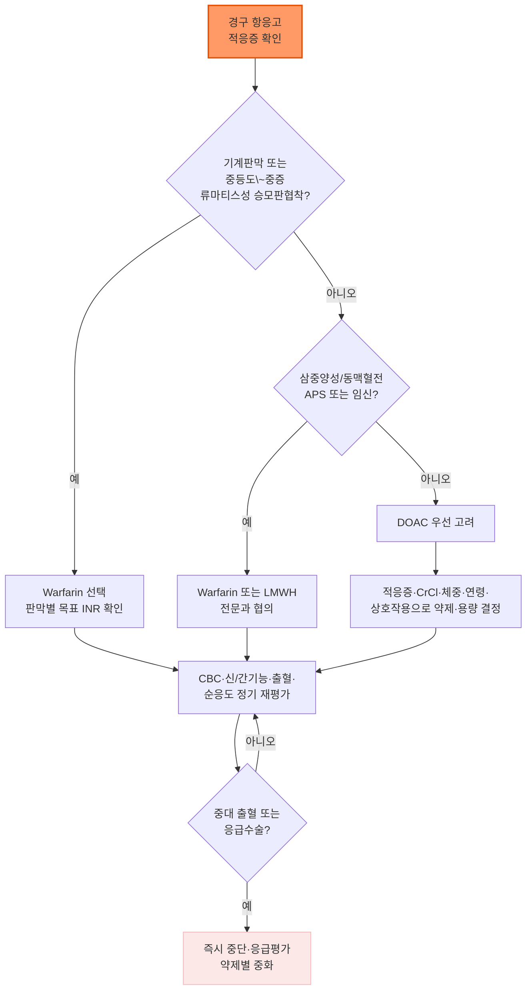

# 항혈전제, 항응고제 Antithrombotics, Anticoagulants

## <mark style="color:green;">일반 사항</mark>

* 항혈전제(antithrombotics)는 작용 기전에 따라 <mark style="color:orange;">항혈소판제</mark>와 <mark style="color:orange;">항응고제</mark>로 구분한다.
* 항혈소판제 : 혈소판 활성화·응집을 억제하여 주로 동맥혈전(관상동맥·뇌혈관·말초동맥질환) 예방에 사용
* 항응고제 : 응고 cascade를 억제하여 심방세동의 심장색전성 뇌졸중 예방, 정맥혈전색전증(VTE)의 예방·치료, 기계식 인공심장판막 관리 등에 사용
* 처방 전 공통 평가 항목 : 적응증, 출혈위험, 신기능(Cockcroft–Gault CrCl), 체중, 연령, 병용약물, 임신 가능성, 환자 선호도

(☞ [항혈전제 급여기준](https://www.hira.or.kr/rc/insu/insuadtcrtr/InsuAdtCrtrPopup.do?mtgHmeDd=20250201\&sno=4\&mtgMtrRegSno=0001))

***

### <mark style="color:$danger;">🚩 Red Flags!</mark>

<mark style="color:$danger;">**즉각 조치 또는 응급실 이송**</mark> <mark style="color:$danger;">- 생명 위협 또는 즉각적 위해 가능성</mark>

* 항혈전제 복용 중 갑작스러운 심한 두통, 의식저하, 새로 생긴 국소신경학적 이상 (→ 두개내출혈 의심)
* 토혈, 지속되는 다량의 혈변·흑색변, 혈역학적 불안정을 동반한 출혈
* 두부외상 후 의식 변화·구토·심한 두통 (→ 특히 고령·항응고제 복용자)
* 급성 사지허혈, 폐색전증 또는 뇌졸중이 의심되는 증상

<mark style="color:$warning;">**당일 또는 조기 의뢰**</mark>

* 육안적 혈뇨, 반복되는 흑색변, 원인 불명의 유의한 Hb 감소
* 항응고제 과량 복용, 중대한 약물상호작용 발생, 출혈을 동반한 INR 상승 또는 INR ＞10
* 응급 수술·침습적 시술이 필요하거나 신기능이 급격히 악화된 경우
* 임신 중 항응고가 필요한 경우 또는 기계식 인공판막 환자의 임신 확인 → 고위험 산과·순환기내과 협진

<mark style="color:$info;">**외래 추적 / 추가 평가 계획**</mark> <mark style="color:$info;">- 즉각 위험 낮으나 호전 없으면 의뢰</mark>

* 반복되는 코피·잇몸출혈·쉽게 드는 멍, 월경과다
* NSAID·항혈소판제·한약재·건강기능식품 등 출혈위험 병용약 사용
* 복약 순응도 저하(누락, 비용, 삼킴곤란) 또는 원인 불명의 반복적 미세 출혈 징후
* 출혈이 없는 INR 4.5～10 : warfarin 일시 보류, 원인·상호작용 교정 및 조기 INR 재검을 개별화(기계판막 등 혈전 고위험군은 전문과 상의)

***

## <mark style="color:green;">평가 및 약제 선택</mark>

### <mark style="color:orange;">초기 평가·재평가</mark>

1. 적응증과 예상 치료기간 : 심방세동, VTE(유발성/비유발성), 기계판막, 항인지질항체증후군, 수술 후 예방 등
2. 대사 평가 : CBC, creatinine, Cockcroft–Gault creatinine clearance(CrCl), 간기능, 체중
3. 출혈 위험 인자 : 과거 출혈, 조절되지 않는 고혈압, 신·간질환, 낙상 위험, 과도한 음주, 임신 가능성
4. 병용약물 : 항혈소판제·NSAID, P-gp/CYP3A4 억제제·유도제, 한약재·건강기능식품
5. 실행 가능성 : 복약순응도, 비용, 복용 횟수, 삼킴곤란, 정기 검사 가능 여부, 환자 선호


DOAC(direct oral anticoagulant)는 정기적인 INR 측정이 필요 없다는 뜻이지, 추적검사 자체가 필요 없다는 뜻이 아니다. CBC·CrCl·간기능·체중·출혈 징후·복약순응도·병용약을 정기적으로 재평가하며, 고령·허약·신기능 저하·탈수·급성질환 발생 시에는 더 자주 확인한다.


### <mark style="color:orange;">HAS-BLED 출혈위험 평가</mark>

심방세동 환자에서 교정 가능한 출혈 위험인자를 찾기 위한 도구이며, 점수가 높다는 이유만으로 항응고제 투여를 거부하거나 중단하는 근거로 사용하지 않는다.

<table><thead><tr><th width="60">항목</th><th>기준</th><th width="70">점수</th></tr></thead><tbody><tr><td>H</td><td>조절되지 않는 고혈압 (수축기혈압 ＞160 ㎜Hg)</td><td>1</td></tr><tr><td>A</td><td>신기능 이상(투석·이식·Cr ＞2.26 ㎎/㎗) 및 간기능 이상(간경변 또는 빌리루빈 ＞2×ULN·AST/ALT/AP ＞3×ULN)</td><td>각 1 (최대 2)</td></tr><tr><td>S</td><td>뇌졸중 과거력</td><td>1</td></tr><tr><td>B</td><td>주요 출혈 병력 또는 출혈 소인</td><td>1</td></tr><tr><td>L</td><td>불안정한 INR (Time in therapeutic range ＜60%)</td><td>1</td></tr><tr><td>E</td><td>연령 ＞65세</td><td>1</td></tr><tr><td>D</td><td>Drugs(항혈소판제·NSAID 등 출혈위험 약물) 및 Alcohol(과도한 음주, ≥8 표준잔/주)</td><td>각 1 (최대 2)</td></tr></tbody></table>

✽점수별 절대 출혈위험 수치(Euro Heart Survey 등)는 과거 warfarin 중심 코호트에서 산출되어 현대 DOAC 사용 환자에게 그대로 적용하기 어려우므로 절대값보다 위험인자 교정 목적으로 활용한다. (☞ [온라인 계산기](https://www.mdcalc.com/has-bled-score-major-bleeding-risk))

### <mark style="color:orange;">약제 선택 원칙</mark>

* 적합한 비판막성 심방세동과 VTE에서는 일반적으로 DOAC를 warfarin보다 우선 고려한다.


**⚠️ 기계식 인공심장판막에서는 DOAC를 사용하지 않는다**\
RE-ALIGN 연구에서 dabigatran이 기계판막 환자에서 혈전·출혈 모두 warfarin보다 불리하여 조기 중단되었다. 기계판막 환자는 warfarin을 사용한다.


* 중등도\~중증 류마티스성 승모판협착을 동반한 심방세동에서는 warfarin을 우선한다(주요 DOAC 임상연구에서 제외된 집단).
* 항인지질항체증후군, 특히 삼중양성이거나 동맥혈전 병력이 있는 경우 warfarin을 우선한다. 단순 항체 양성이라는 이유만으로 모두 동일하게 판단하지 않는다.
* 임신 중에는 DOAC를 일반적으로 피하고 LMWH를 우선 고려한다. 기계판막을 가진 임신부는 고위험 산과·순환기내과 협진이 필요하다.

***



<p align="center"><strong>경구 항응고제 선택 및 추적관리 알고리듬</strong></p>

<p align="center"><em><mark style="color:$info;">Ref. 2024 ESC Guidelines for the Management of Atrial Fibrillation; 2023 ACC/AHA/ACCP/HRS Atrial Fibrillation Guideline 개념을 재구성</mark></em></p>

***

## <mark style="background-color:$warning;">Management</mark>


**약제군별 우선 사용 원칙**

항혈소판제는 동맥혈전(관상동맥·뇌·말초동맥) 예방에, 항응고제는 심방세동의 심장색전 및 정맥혈전색전증 예방·치료에 사용한다. 두 계열을 함께 사용해야 하는 경우(예: 심방세동 환자의 PCI 후)에는 병용 기간을 최소화하는 것이 최근 지침의 공통된 방향이다.


* 장기 경구항응고가 필요한 PCI 환자에서는 불필요한 장기 삼중요법(항응고제+aspirin+P2Y12 억제제)을 피한다. 일반적으로 PCI 후 1\~4주 사이 aspirin을 중단하고 항응고제 + P2Y12 억제제(대개 clopidogrel)를 유지하는 전략을 순환기내과와 결정한다. [2025 ACC/AHA/ACEP/NAEMSP/SCAI ACS 지침]
* 관상동맥 스텐트 삽입 환자의 항혈소판제를 임의로 중단하지 않는다 — 스텐트 혈전증 위험.
* 항응고제·항혈소판제 모두 중단이 필요한 상황(중대한 출혈, 응급수술, 환자의 결정)이 생기면 즉시 중단 후 전문과와 재개 시점을 협의한다.

## <mark style="color:green;">약물 치료</mark>

### <mark style="color:orange;">항혈소판제</mark>

#### <mark style="color:$primary;">Aspirin</mark>

* 기전 : 혈소판 COX-1을 비가역적으로 억제하여 thromboxane A₂ 생성을 감소시킴
* 주된 역할 : 관상동맥질환·허혈뇌졸중·말초동맥질환의 이차예방, ACS/PCI 후 병용치료
* 장기 항혈소판요법 : 일반적으로 75\~100 ㎎ qd (지침·적응증에 따라 75\~162 ㎎/day) <mark style="color:blue;">\[아스피린프로텍트]</mark>
* 신속한 억제가 필요한 경우(ACS 등) : 씹어서 162\~325 ㎎ 부하 후 유지용량으로 전환
* 부작용 : 소화불량, 위염·소화성궤양, 출혈, 기관지경련·과민반응, 신기능 악화
* 금기 : 활동성 중대한 출혈, aspirin/NSAID에 대한 중증 과민반응, aspirin 유발 호흡기질환 등 제품 허가상 금기
* 고령, 소화성궤양 병력, corticosteroid·NSAID·항응고제 병용은 절대금기가 아니라 출혈 고위험 요인이다. 위장관 출혈 고위험이면 PPI 병용을 고려한다.
* Ibuprofen 등 일부 NSAID는 aspirin의 비가역적 혈소판 억제 효과를 방해하고 위장관 출혈 위험을 높일 수 있어 가급적 병용을 피한다. 병용이 불가피하면 제형·투여 간격을 확인한다.
* 암 예방만을 목적으로 aspirin을 새로 시작하지 않는다.

**심혈관질환 예방**

* 이차예방 : ASCVD 병력이 있으면 금기가 없는 한 저용량 aspirin을 사용한다. Aspirin 알레르기 시 clopidogrel 75 ㎎ qd 등을 고려한다.
* 일차예방 : 출혈위험이 낮고 심혈관위험이 높은 일부 환자에서만 개별적으로 고려한다. ≥60세에서 일차예방 목적의 신규 투여는 권고하지 않는다 [USPSTF, 2022].
* 당뇨병 환자 : ASCVD 병력이 있으면 이차예방으로 사용하고, 일차예방은 심혈관 이득과 출혈위험을 환자와 함께 논의한다 [ADA Standards of Care in Diabetes, 2026].
* 안정된 관상동맥·말초동맥질환에서 허혈위험이 높고 출혈위험이 낮은 일부 환자는 aspirin + rivaroxaban 2.5 ㎎ bid를 고려할 수 있다(COMPASS 요법). 이는 심방세동의 항응고 용량이 아니다.

#### <mark style="color:$primary;">P2Y12 수용체 억제제</mark>

Thienopyridine(ticlopidine, clopidogrel, prasugrel)과 비-thienopyridine(ticagrelor)으로 구분한다.

<table><thead><tr><th width="140">약제</th><th width="190">주요 용법</th><th>핵심 주의사항</th></tr></thead><tbody><tr><td>Clopidogrel<br><mark style="color:blue;">\[플라빅스]</mark></td><td>유지 75 ㎎ qd<br>ACS·PCI 부하 300\~600 ㎎</td><td>CYP2C19 기능저하·상호작용 시 반응이 감소할 수 있다. 부하용량과 시점은 ACS 유형·PCI 계획·연령·출혈위험에 따라 결정한다.<br>복합제 : clopidogrel 75 ㎎+aspirin 100 ㎎ <mark style="color:blue;">\[플라빅스에이]</mark>, <mark style="color:blue;">\[클라빅신 듀오]</mark> 등</td></tr><tr><td>Prasugrel<br><mark style="color:blue;">\[에피언트]</mark></td><td>부하 60 ㎎ → 10 ㎎ qd<br>체중 ＜60 ㎏ : 5 ㎎ qd 고려</td><td><mark style="color:red;">뇌졸중 또는 TIA 병력은 금기.</mark> ≥75세에는 일반적으로 권장하지 않으며 예외적으로 매우 높은 허혈위험에서만 신중히 고려한다.</td></tr><tr><td>Ticagrelor<br><mark style="color:blue;">\[브릴린타]</mark></td><td>부하 180 ㎎ → 90 ㎎ bid<br>선별된 장기 연장치료 : 60 ㎎ bid</td><td>호흡곤란, 서맥, 출혈, 강력한 CYP3A4 억제제·유도제와의 상호작용에 주의한다. Aspirin은 저용량으로 병용한다.</td></tr><tr><td>Ticlopidine<br><mark style="color:blue;">\[유유크리드정 250 ㎎]</mark></td><td>250 ㎎ bid</td><td>호중구감소증, 혈전성혈소판감소성자반증(TTP), 재생불량빈혈 위험으로 현재는 제한적으로 사용한다. 치료 초기 수개월간 CBC를 정기 확인한다. 작용 발현이 느려 급성기 치료에는 권장하지 않는다.</td></tr></tbody></table>

✽유유크리드정(ticlopidine hydrochloride 250 ㎎ 단일제)과 유크리드정(ticlopidine 250 ㎎+은행엽엑스 80 ㎎ 복합제)은 이름이 유사하니 처방 시 혼동하지 않는다.

**이중항혈소판요법(DAPT)**

* ACS에서는 aspirin + P2Y12 억제제가 기본이며, 출혈 고위험이 아니면 통상 12개월을 기본 전략으로 한다. PCI 형태·허혈위험·출혈위험에 따라 기간 단축, P2Y12 단독요법 전환 또는 연장을 개별화한다 [2025 ACC/AHA/ACEP/NAEMSP/SCAI ACS 지침].
* 섬유소용해 치료를 받은 STEMI 환자에서는 clopidogrel 기반 DAPT가 권장되며 부하용량 적용이 달라질 수 있다.

#### <mark style="color:$primary;">Dipyridamole</mark>

* 기전 : phosphodiesterase 억제와 adenosine 작용 증가를 통해 혈소판 내 cAMP를 증가시킴
* 부작용 : 두통, 안면홍조, 어지럼증, 저혈압, 소화기 증상, 관상동맥질환 환자에서 혈관확장에 의한 증상 악화 주의
* 허혈뇌졸중 이차예방 복합제 : 서방형 dipyridamole 200 ㎎+aspirin 25 ㎎, 1캡슐 bid <mark style="color:blue;">\[디피아녹스]</mark>

#### <mark style="color:$primary;">기타 항혈소판제</mark>

* Vorapaxar(PAR-1 억제제) : 뇌졸중·TIA·두개내출혈 병력에서 금기. 국내 허가·유통 여부를 처방 전 확인한다.
* Atopaxar는 임상시험 단계 약물로 일반 처방약 목록에서 제외한다.

### <mark style="color:orange;">항응고제</mark>

#### <mark style="color:$primary;">Warfarin</mark>

* 기전 : Vitamin K epoxide reductase를 억제하여 응고인자 II, VII, IX, X와 protein C·S의 합성을 감소시킴
* 목표 INR은 적응증에 따라 통상 2.0\~3.0이다. 기계판막은 판막 위치·종류·추가 혈전위험인자에 따라 목표가 달라진다(예 : 일부 저위험 기계 대동맥판막은 목표 INR 2.5, 치료범위 2.0\~3.0; 일부 기계 승모판막·고위험 조건은 목표 INR 3.0, 치료범위 2.5\~3.5). 일률적으로 적용하지 않고 심장내과 기준을 확인한다.
* 시작 용량은 통상 2\~5 ㎎/day 범위에서 개별화한다. 특별한 위험인자가 없는 평균적 성인은 5 ㎎/day 전후로 시작할 수 있으나, 고령, 저체중, 영양불량, 간질환, 심부전, 상호작용 약물 사용 시에는 2\~3 ㎎/day의 낮은 용량으로 시작하는 경우가 많다. 초기 INR 검사 간격은 임상 상황에 따라 조절하며, 외래에서 매일 검사가 필수는 아니다.
* 급성 VTE를 warfarin으로 치료할 때는 비경구 항응고제를 최소 5일간 병용하고 INR ≥2.0이 최소 24시간 유지될 때까지 중첩한다 — warfarin 단독은 초기에 충분한 항응고 효과를 내지 못한다.
* 안정화 후에는 흔히 약 4주 간격으로 INR을 확인하며, 장기간 매우 안정적인 일부 환자는 더 긴 간격을 고려할 수 있다.
* 부작용 : 출혈, 특히 고령 환자에서 두개내출혈 위험 상승
* Vitamin K 함유 식품(녹황색 채소 등)을 금지하지 말고 섭취량을 일정하게 유지하도록 교육한다.

#### <mark style="color:$primary;">DOAC(direct oral anticoagulant)</mark>

직접적으로 응고인자(thrombin 또는 Xa factor)를 억제하며, 정기적인 용량 조절용 혈액검사가 필요 없다.

<table><thead><tr><th width="110">약제</th><th width="150">비판막성 AF</th><th width="170">급성 DVT/PE 치료</th><th>주요 감량·복용 원칙</th></tr></thead><tbody><tr><td>Dabigatran<br><mark style="color:blue;">\[프라닥사]</mark></td><td>150 ㎎ bid<br>조건에 따라 110 ㎎ bid</td><td>비경구 항응고제 5\~10일 후 150 ㎎ bid</td><td>신기능·연령·출혈위험·P-gp 병용약에 따라 결정한다. 캡슐을 열거나 씹지 않는다.</td></tr><tr><td>Rivaroxaban<br><mark style="color:blue;">\[자렐토]</mark></td><td>20 ㎎ qd<br>신기능 저하 시 15 ㎎ qd</td><td>15 ㎎ bid 21일 → 20 ㎎ qd</td><td>15 ㎎·20 ㎎은 음식과 함께 복용한다. VTE 초기치료 완료 후 연장치료는 10 ㎎ qd를 사용하며, 재발위험이 높으면 20 ㎎ qd를 고려한다.</td></tr><tr><td>Apixaban<br><mark style="color:blue;">\[엘리퀴스]</mark></td><td>5 ㎎ bid<br>감량기준 충족 시 2.5 ㎎ bid</td><td>10 ㎎ bid 7일 → 5 ㎎ bid</td><td>AF에서 연령 ≥80세, 체중 ≤60 ㎏, 혈청 크레아티닌 ≥1.5 ㎎/㎗ 중 2개 이상이면 2.5 ㎎ bid. 이 기준을 급성 VTE 치료에 임의 적용하지 않는다. VTE 초기치료 6개월 완료 후 연장치료는 2.5 ㎎ bid.</td></tr><tr><td>Edoxaban<br><mark style="color:blue;">\[릭시아나]</mark></td><td>60 ㎎ qd<br>감량조건 시 30 ㎎ qd</td><td>비경구 항응고제 5\~10일 후 60 ㎎ qd 또는 감량용량</td><td>CrCl 15\~50 ㎖/min, 체중 ≤60 ㎏ 또는 특정 P-gp 억제제 병용 시 30 ㎎ qd.<br>미국 FDA 라벨은 CrCl ＞95 ㎖/min인 NVAF 환자에서 효과 감소 가능성 때문에 사용을 권장하지 않지만, EMA/EHRA는 개별 혈전·출혈위험 평가 후 사용하도록 기술한다. 국내에서는 최신 허가사항을 확인한다.<br><mark style="color:red;">15 ㎎ qd는 국내 첨부문서에 제시된 모든 기준을 충족하는 고령자(약 80세 이상) 중 출혈위험이 높아 허가된 표준용량 항응고요법이 적합하지 않은 NVAF 환자에서 고려하는 제한적 대안용량이다.</mark> 일반 감량용량이나 VTE 치료용량과 혼동하지 않는다.</td></tr></tbody></table>


**⚠️ 임의 감량 금지**\
DOAC는 약제별로 허가된 감량 조건을 충족하지 않는데도 출혈이 염려된다는 이유만으로 임의 감량하지 않는다. 근거 없는 저용량은 혈전색전 예방 효과를 떨어뜨릴 수 있다.


**DOAC 복용 누락 시 대처(의료진용)**

<table><thead><tr><th width="130">약제·치료 단계</th><th>대처</th></tr></thead><tbody><tr><td>Dabigatran bid</td><td>다음 복용까지 6시간 이상 남았으면 즉시 복용하고, 6시간 미만이면 건너뛴다. 두 배로 복용하지 않는다.</td></tr><tr><td>Apixaban bid</td><td>누락을 알게 된 즉시 복용하고 이후 정해진 시간에 bid 복용을 계속한다. 같은 날 누락분을 보충하기 위한 임의의 추가 복용은 피한다.</td></tr><tr><td>Rivaroxaban 15 ㎎ bid<br>급성 VTE 초회 21일</td><td>당일 총 30 ㎎을 복용하도록 누락 용량을 즉시 복용한다. 필요한 경우 15 ㎎ 2정을 한꺼번에 복용할 수 있다.</td></tr><tr><td>Rivaroxaban qd</td><td>같은 날 생각나면 즉시 복용하고 다음 날부터 정상 복용한다. 다음 날 두 배로 복용하지 않는다.</td></tr><tr><td>Edoxaban qd</td><td>같은 날 생각나면 즉시 복용하고 다음 날부터 정상 복용한다. 두 배로 복용하지 않는다.</td></tr></tbody></table>

✽용량 결정의 신기능 기준은 원칙적으로 Cockcroft–Gault CrCl을 사용하며, 검사실에서 보고되는 eGFR(MDRD/CKD-EPI)로 임의 대체하지 않는다.

#### <mark style="color:$primary;">비경구 항응고제</mark>

* UFH(unfractionated heparin) : aPTT 또는 anti-Xa로 모니터링하며 INR을 사용하지 않는다. 중증 신장애, 신속한 중단·중화가 필요한 상황에서 유용하다.
* LMWH(low molecular weight heparin) : 일반적으로 일상적 모니터링이 필요 없으나 임신, 극단적 체중, 중증 신장애 등 특정 상황에서 anti-Xa를 고려한다.
* Fondaparinux : 신배설 약물이므로 중증 신장애에서는 피한다.

***

## <mark style="color:green;">시술 및 기타 처치</mark>

### <mark style="color:orange;">수술·시술 전후 관리</mark>

* 시술의 출혈위험과 환자의 혈전위험을 함께 평가하고, 처방의·시술의와 계획을 사전에 공유한다.
* Warfarin은 중단이 필요한 대부분의 시술에서 약 5일 전 중단하되, 목표 INR·시술 종류에 따라 3\~5일로 개별화한다. 주요 수술에서는 시술 직전 INR을 확인하고 흔히 ＜1.5를 목표로 하지만, 실제 허용치는 시술·마취 방식별 기준을 따른다. 목표에 도달하지 못하면 시술을 연기하거나 소량의 vitamin K 투여를 고려한다. 출혈위험이 매우 낮은 시술(단순 치과처치, 피부 시술, 백내장 수술 등)은 중단 없이 유지할 수 있다.
* 단순 심방세동이나 과거 VTE라는 이유만으로 LMWH/UFH bridging을 일률적으로 시행하지 않는다 [CHEST, 2022]. 최근 VTE, 일부 고위험 기계판막 등 매우 높은 혈전위험군에서만 전문과와 개별적으로 고려한다.
* DOAC 중단기간은 약제, CrCl, 시술 출혈위험에 따라 정한다. Dabigatran은 신기능의 영향을 특히 많이 받는다. DOAC에는 통상 bridging이 필요 없다.
* 재개 시점 : 지혈이 확보되면 warfarin은 흔히 당일 저녁\~24시간 내 재개한다. DOAC는 저출혈위험 시술 후 약 24시간, 고출혈위험 시술 후 약 48\~72시간 재개를 흔히 고려하되 실제 지혈 상태에 따라 조절한다.
* 항혈소판제 중단·재개는 ACS·PCI 시점과 스텐트 혈전위험을 고려하여 심장내과와 협의한다. 최근 관상동맥 스텐트 환자는 임의로 중단하지 않는다.
* 지속성 NSAID(예 : celecoxib)는 혈소판 기능에 미치는 영향이 제한적이므로 warfarin·항혈소판제와 동일하게 "1주 전 중단"으로 일괄 분류하지 않고 약제별로 판단한다.
* 신경축마취·척추천자를 계획하는 경우에는 별도의 마취과 지침을 따른다.

### <mark style="color:orange;">중대한 출혈과 중화</mark>

활동성 중대한 출혈에서는 원인 항응고제를 즉시 중단하고, 마지막 복용시간·CrCl·CBC·PT/INR·aPTT 등 가능한 검사를 확인하며 응급실·전문과에서 처치한다.

<table><thead><tr><th width="130">원인 약제</th><th width="190">우선 중화·대응</th><th>비고</th></tr></thead><tbody><tr><td>Warfarin</td><td>4-factor PCC + IV vitamin K</td><td>PCC 사용이 어려운 경우 FFP 고려</td></tr><tr><td>Dabigatran</td><td>Idarucizumab 5 g IV</td><td>신부전·지속 출혈 시 재상승 가능성 및 투석 고려</td></tr><tr><td>Apixaban·Rivaroxaban</td><td>국내에서는 4-factor PCC 등 기관 프로토콜</td><td>Andexanet alfa는 apixaban·rivaroxaban의 특이 중화제로 개발되었으나 ANNEXA-I에서 혈전색전 사건과 사망 증가가 확인되어 FDA가 이익-위험에 우려를 제기하였다. 제조사가 BLA를 자진 철회하여 미국에서는 2025년 12월 22일 생산·판매가 종료되었다. 유럽·일본 등 일부 지역에서는 허가가 유지되지만 국내에서 통상 사용할 수 있는 표준 중화제로 보기 어렵다.</td></tr><tr><td>Edoxaban</td><td>4-factor PCC 등 기관 프로토콜</td><td>Andexanet alfa의 적용 근거가 확립되지 않았다.</td></tr><tr><td>UFH</td><td>Protamine</td><td>투여 후 경과시간과 heparin 용량으로 용량 계산</td></tr><tr><td>LMWH</td><td>Protamine</td><td>부분 중화만 가능</td></tr></tbody></table>

***

## <mark style="color:purple;">처방례</mark>

> **처방례 1. 비판막성 심방세동, 표준 신기능**
>
> ```
> 자렐토정 20 ㎎  1정  1일 1회  아침 식사와 함께
> ```
>
> _✽CrCl ≥50 ㎖/min인 비판막성 심방세동 환자의 표준 뇌졸중 예방 용량. 음식과 함께 복용해야 흡수율이 확보됨_

> **처방례 2. 비판막성 심방세동, 고령·저체중·신기능저하 동반**
>
> ```
> 엘리퀴스정 2.5 ㎎  1정  1일 2회
> ```
>
> _✽연령 ≥80세, 체중 ≤60 ㎏, 혈청 크레아티닌 ≥1.5 ㎎/㎗ 중 2가지 이상을 만족하여 감량용량 적용. 이 기준은 심방세동 감량기준이며 급성 VTE 치료에는 적용하지 않음_

> **처방례 3. 급성 심부정맥혈전증(DVT), 초회기\~유지기**
>
> ```
> 엘리퀴스정 5 ㎎  2정  1일 2회  7일간
> 이후 엘리퀴스정 5 ㎎  1정  1일 2회로 전환
> ```
>
> _✽Apixaban 단독요법으로 비경구 항응고제 선행이 필요 없음. 초회 7일은 10 ㎎ bid로 시작 후 5 ㎎ bid 유지용량으로 전환. 2.5 ㎎ bid는 이 유지용량이 아니라 최소 6개월 초기치료 완료 후의 연장예방 또는 AF 감량기준 용량이므로 혼동하지 않는다_

> **처방례 4. 급성관상동맥증후군/PCI 후 이중항혈소판요법(DAPT)**
>
> ```
> 아스피린프로텍트정 100 ㎎  1정  1일 1회
> 플라빅스정 75 ㎎  1정  1일 1회
> ```
>
> _✽부하용량(clopidogrel 300\~600 ㎎)은 시술 당일 별도 처방. 출혈 고위험이 아니면 통상 12개월 유지_

> **처방례 5. 기계식 인공심장판막**
>
> ```
> 와파린정 2 ㎎ 또는 5 ㎎  INR에 따라 산정한 1일 용량  1일 1회 일정한 시간
> ```
>
> _✽기계판막 환자의 유지요법 예시. 실제 1일 용량과 목표 INR은 판막 위치·종류·혈전위험인자 및 측정 INR에 따라 개별 조정하며 심장내과 기준을 따른다._

***

### <mark style="color:$success;">핵심 복약 지도</mark>

> **DOAC 복용 원칙**
>
> * 매일 같은 시간에 복용하도록 안내한다.
> * 복용 누락 시 대처는 약제와 치료 단계마다 다르다. 임의로 보충하지 말고 처방 시 받은 약제별 지침을 따른다.
> * Dabigatran 캡슐은 습기에 약하므로 원래 포장에 보관하고, 복용 직전에 꺼내며 캡슐을 열거나 씹지 않는다.
> * Rivaroxaban 15 ㎎·20 ㎎은 음식과 함께 복용해야 흡수율이 확보된다.

> **수술·시술 전 알림**
>
> * 치과치료, 내시경, 수술 계획이 생기면 약 이름과 마지막 복용시간을 미리 알리도록 안내한다.
> * 임의로 며칠씩 미리 중단하지 않고 처방의의 지침에 따르도록 한다.

> **언제 다시 병원을 방문해야 하나요?**
>
> * 검은 변, 혈뇨, 코피나 잇몸출혈이 멎지 않는 경우
> * 갑작스러운 심한 두통, 팔다리 마비, 언어장애
> * 항응고제 복용 중 머리를 세게 부딪혔거나 두통·구토·졸림·혼돈이 생긴 경우. 고령자나 유의한 두부외상은 증상이 없어도 의료진과 즉시 상의
> * 새로운 약(진통제 포함), 한약, 건강기능식품을 시작하기 전

***

### <mark style="color:blue;">환자 안내서</mark>


**항혈전제, 왜 꾸준히 먹어야 하나요?**

항혈전제는 혈액이 혈관 안에서 굳어 피가 통하지 못하게 되는 것을 막아주는 약입니다. 뇌졸중, 심근경색, 폐색전증처럼 생명을 위협할 수 있는 병을 예방하기 위해 복용합니다.


#### <mark style="color:$primary;">왜 이 약이 필요한가요?</mark>

* 심방세동, 정맥혈전증, 심장 스텐트 시술 등 특정 상태에서는 혈전(피떡)이 생기기 쉬워집니다.
* 이 약은 혈전이 생기는 것을 막아 뇌졸중이나 심근경색, 폐색전증을 예방합니다.

#### <mark style="color:$primary;">복용할 때 무엇을 지켜야 하나요?</mark>

* **매일 같은 시간에 복용하세요.** 복용을 잊으면 혈전 예방 효과가 떨어질 수 있습니다.
* **의사와 상의 없이 임의로 중단하거나 용량을 바꾸지 마세요.** 갑자기 끊으면 오히려 혈전 위험이 높아질 수 있습니다.
* **진통제, 감기약, 한약, 건강기능식품도 함부로 함께 복용하지 마세요.** 일부 진통제(이부프로펜 등)는 출혈 위험을 높이거나 약효를 방해할 수 있습니다.
* 와파린을 복용 중이라면 녹황색 채소(비타민 K 함유 식품)를 끊을 필요는 없지만, 갑자기 양을 크게 늘리거나 줄이지 말고 평소대로 일정하게 드세요.

#### <mark style="color:$primary;">이럴 때는 즉시 병원을 방문하세요</mark>

* 대변이 검게 나오거나, 소변에 피가 섞이거나, 코피·잇몸출혈이 멎지 않을 때
* 갑자기 심한 두통이 생기거나, 팔다리에 힘이 빠지거나, 말이 어눌해질 때
* 항응고제 복용 중 머리를 세게 부딪혔거나 두통·구토·졸림·혼돈이 생기면 즉시 진료받으세요. 어르신이나 강한 두부외상은 증상이 없어도 의료진과 바로 상의하세요.
* 수술이나 발치, 내시경 계획이 생기면 미리 담당 의료진에게 복용 중인 약을 알리세요
