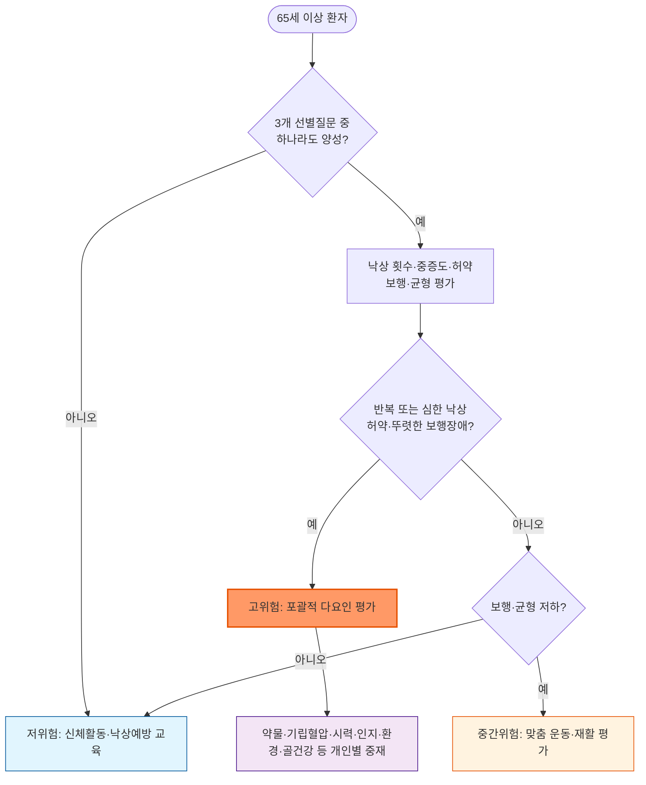
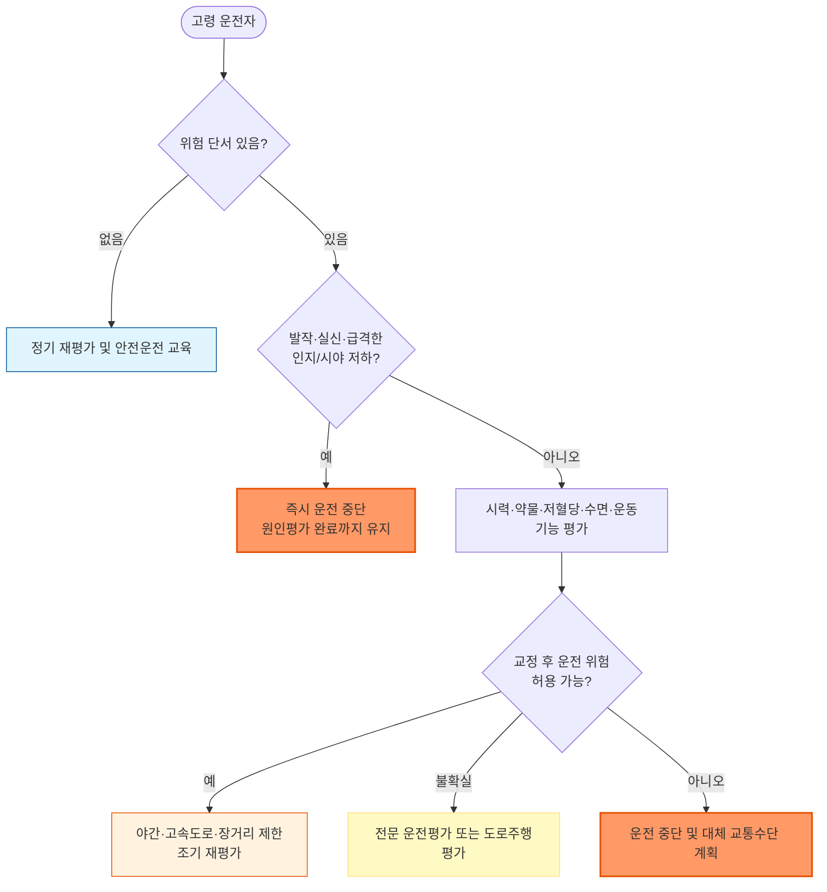

# 고령 환자 진료

## <mark style="color:green;">일반 사항 테스트</mark>

* 고령 환자 진료에서는 연령 자체보다 생리적 예비능, 다중이환(multimorbidity), 기능상태, 허약(frailty), 인지·정서, 사회적 지지와 환자의 우선순위를 함께 평가함
* 진료 목표는 질환별 치료와 함께 **기능·독립성·삶의 질 및 환자가 중요하게 생각하는 생활을 보존**하는 것
* 포괄적 노인평가(Comprehensive Geriatric Assessment, CGA)는 의학적 문제, 기능, 인지·정서, 영양, 약물, 사회·환경 영역을 통합해 개인별 관리계획을 수립하는 과정
* 모든 영역을 한 번에 정밀검사하기보다 간단히 선별한 뒤, 이상이 있는 영역을 심층 평가하고 관련 챕터 또는 전문진료로 연결
* 이 챕터는 CGA의 공통 틀과 기능·허약 평가, 낙상, 운전, 약물 안전, 근감소증을 중점적으로 다룸. 경도인지저하, 우울, 비의도적 체중감소 및 영양 치료의 상세 내용은 각각의 해당 챕터를 참조

***

### <mark style="color:$danger;">🚩 Red Flags!</mark>

<mark style="color:$danger;">**즉각 조치 또는 응급실 의뢰**</mark> <mark style="color:$danger;">- 생명 위협 또는 즉각적 위해 가능성</mark>

* 낙상 후 의식 변화, 지속되는 두통·반복 구토, 국소 신경학적 이상 또는 경련, 특히 항응고제 복용 중인 환자 → 두개내출혈 평가
* 낙상 후 고관절 통증, 하지 단축·외회전 또는 체중 부하 불가 → 고관절 골절 의심
* 실신 또는 일과성 의식소실을 동반한 낙상, 흉통·호흡곤란·심계항진 또는 심전도 이상 동반
* 갑자기 발생하거나 하루 중 변동하는 혼돈·주의력 저하 → 급성 섬망으로 간주하고 약물, 감염, 저산소증, 대사 이상, 통증, 요폐·분변매복 등을 신속 평가
* 아편유사제·benzodiazepine 등 중추신경억제제 과량 복용 의심: 의식 저하, 느리거나 얕은 호흡, 청색증
* 급성 편측 마비·언어장애, 새로 발생한 발작, 급격한 보행 불능
* 급성 하지 위약과 함께 새로 발생한 요실금·요폐 또는 변실금, 안장마취(saddle anesthesia) → 마미증후군(cauda equina syndrome) 의심, 즉시 영상검사·전문진료 의뢰
* 노인학대·방임이 의심되고 환자에게 현재 즉각적인 신체적 위험이 있음

<mark style="color:$warning;">**당일 또는 조기 평가·의뢰**</mark>

* 최근 1년 내 반복 낙상(≥2회), 부상으로 진료가 필요했던 낙상, 낙상 후 스스로 일어나지 못했거나 실신이 의심되는 경우
* 수일～수주 사이 새로 발생한 ADL/IADL 저하, 보행 장애 또는 반복적인 약물 복용 오류
* 고위험 약물 복용 중 새로 발생한 인지 저하, 심한 졸림, 기립성 어지럼, 보행 불안정
* 새로 발생한 연하곤란·반복 흡인, 탈수 또는 빠르게 진행하는 비의도적 체중감소
* 고령 운전자에서 새로 발생한 발작, 실신, 급격한 인지·시력·운동기능 저하 → 평가가 끝날 때까지 운전 중단 권고
* 노인학대·방임 또는 경제적 착취가 의심되나 당장의 생명 위협은 명확하지 않은 경우 → 환자와 단독 면담, 안전계획 및 관련 기관 연계

<mark style="color:$info;">**계획된 외래 추적 및 추가 평가**</mark>

* ADL은 유지되나 IADL 일부가 새로 어려워짐 → 원인평가 및 기능 추적
* 다약제(통상 ≥5종) 또는 고위험 약물 복용 중이나 급성 위해 징후 없음 → 약물조정(medication reconciliation)과 단계적 감량 계획
* SARC-F ≥4점, 종아리둘레 감소 또는 근력 저하 → 근감소증 추가 평가
* 낙상은 없으나 서 있거나 걸을 때 불안정하거나 넘어질까 걱정함 → 객관적 보행·균형 평가와 맞춤 운동
* 청력·시력 저하, 요실금, 변비, 구강 문제, 사회적 고립 또는 돌봄자 부담이 확인됨 → 해당 영역 평가·중재

***

## <mark style="color:green;">포괄적 노인평가 Comprehensive Geriatric Assessment</mark>

### <mark style="color:orange;">1차 진료용 핵심 점검표</mark>

<table><thead><tr><th width="150">영역</th><th>확인할 내용</th><th width="210">양성 선별 후 조치</th></tr></thead><tbody><tr><td>환자의 목표</td><td>가장 유지하고 싶은 활동, 치료에서 피하고 싶은 부담, 현재 가장 불편한 문제</td><td>치료 우선순위와 목표를 공동 결정</td></tr><tr><td>기능</td><td>ADL/IADL, 최근 기능 변화, 보행보조기 사용</td><td>원인평가·재활·돌봄 지원</td></tr><tr><td>허약·이동</td><td>피로, 보행, 의자 일어서기, 낙상, 활동량</td><td>운동·영양·약물·질환을 통합 평가</td></tr><tr><td>인지·섬망</td><td>기억·판단 변화, 약·금전 관리 오류, 급성 또는 변동성 혼돈</td><td>급성이면 섬망 평가; 만성이면 경도인지저하/치매 챕터 연계</td></tr><tr><td>정서·수면</td><td>우울감, 흥미 저하, 불안, 수면, 자살사고</td><td>우울 챕터 연계; 자살위험은 즉시 평가</td></tr><tr><td>영양·구강</td><td>체중 변화, 식욕, 식사 준비, 연하·저작, 치아·의치, 구강건조</td><td>체중감소·영양지침 챕터 연계</td></tr><tr><td>감각</td><td>시력·청력 저하, 안경·보청기 상태</td><td>교정 가능한 원인과 보조기기 평가</td></tr><tr><td>배뇨·배변</td><td>요실금·요폐·야간뇨, 변비·분변매복</td><td>가역적 원인과 약물 검토</td></tr><tr><td>약물</td><td>처방약·일반약·건강기능식품, 실제 복용법, 중복·누락</td><td>Brown Bag Review와 처방 재검토</td></tr><tr><td>사회·안전</td><td>독거, 주거환경, 이동·식사·금전 지원, 사회적 고립, 학대·방임</td><td>돌봄자·지역사회 자원 및 보호체계 연계</td></tr><tr><td>의사결정·돌봄계획</td><td>현재 결정에 대한 이해·추론·선택 표현, 대리결정자, 사전돌봄계획</td><td>결정별 의사결정능력 평가와 환자 의사 확인</td></tr></tbody></table>


**급성 기능 저하를 단순한 노화로 보지 않습니다.** 검사 수치가 안정적이어도 수일～수주 사이 걷기, 식사, 배뇨·배변, 약 복용 또는 금전관리가 나빠졌다면 급성질환, 섬망, 통증, 약물 부작용, 낙상·골절을 평가합니다. 고령자의 감염은 발열·기침 같은 전형적 증상이 뚜렷하지 않고 섬망, 식욕부진 또는 기능저하로 발현할 수 있습니다. 다만 요로계 국소 증상이나 전신 감염징후 없이 섬망과 세균뇨만 있는 경우에는 요로감염으로 단정하거나 항생제를 시작하지 말고 탈수, 약물, 통증, 저산소증, 대사 이상 등 다른 원인을 우선 평가합니다.


***

## <mark style="color:green;">기능 평가 Functional Assessment</mark>

### <mark style="color:orange;">ADL과 IADL</mark>

<table><thead><tr><th width="180">평가</th><th>주요 항목</th><th>임상적 의미</th></tr></thead><tbody><tr><td>기본적 일상생활수행능력<br>ADL</td><td>목욕, 옷 입기, 화장실 사용, 이동, 대소변 조절, 식사</td><td>신체적 독립성과 기본 돌봄 필요도</td></tr><tr><td>도구적 일상생활수행능력<br>IADL</td><td>전화·의사소통, 장보기, 식사 준비, 가사, 세탁, 교통수단, 약 관리, 금전관리</td><td>지역사회에서 독립적으로 생활할 능력; 초기 인지·기능 저하에 더 민감</td></tr></tbody></table>

* 현재 수행 여부뿐 아니라 **질병 발생 전 기저기능, 최근 변화 시점, 도움이 필요한 이유**를 확인
* 전통적 성역할을 이유로 해본 적이 없는 활동은 장애로 단정하지 않고, 필요할 때 수행할 능력이 있는지 평가
* 새로 발생한 IADL 저하는 시력·청력, 우울, 인지저하, 약물 부작용, 관절·신경계 질환, 사회환경을 함께 평가
* 기능 저하가 확인되면 재활치료, 보조기기, 가정환경 개선 및 돌봄서비스 필요성을 검토

***

## <mark style="color:green;">허약 Frailty</mark>

* 허약은 여러 생리계의 예비능이 감소하여 감염·수술·약물 변경 같은 작은 스트레스에도 급격한 기능 저하가 발생하기 쉬운 상태
* 근감소증은 근육량·근력에 초점을 둔 질환이고, 장애는 실제 활동 수행 제한을 의미함. 서로 겹칠 수 있으나 같은 개념은 아님

### <mark style="color:orange;">FRAIL scale</mark>

<table><thead><tr><th width="90">항목</th><th>선별 질문</th></tr></thead><tbody><tr><td>Fatigue</td><td>대부분 또는 항상 피로한가?</td></tr><tr><td>Resistance</td><td>도움 없이 계단 한 층을 오르기 어려운가?</td></tr><tr><td>Ambulation</td><td>도움 없이 약 100 m를 걷기 어려운가?</td></tr><tr><td>Illnesses</td><td>원 척도가 지정한 11개 만성질환 중 5개 이상을 진단받았는가?</td></tr><tr><td>Loss of weight</td><td>최근 1년 사이 비의도적으로 체중이 5% 이상 감소했는가?</td></tr></tbody></table>

* 각 항목 1점: 0점 건강, 1～2점 전허약(prefrail), 3～5점 허약으로 선별
* 선별 결과만으로 예후나 치료 제한을 결정하지 않고, 가역적 원인과 환자 목표를 평가
* 중재: 개인별 근력·유산소·균형 운동, 적절한 영양, 약물 최적화, 시력·청력 교정, 만성질환 관리와 사회적 지원

***

## <mark style="color:green;">인지·정서·영양 문제의 선별과 연결</mark>


이 절은 고령자 진료에서 문제를 놓치지 않기 위한 관문입니다. 경도인지저하, 우울, 비의도적 체중감소와 영양 치료의 진단·치료는 각각의 해당 챕터에서 다룹니다.


<table><thead><tr><th width="140">문제</th><th>고령자 진료에서 확인할 단서</th><th>다음 단계</th></tr></thead><tbody><tr><td>급성 섬망</td><td>수시간～수일 내 발생, 하루 중 변동, 주의력 저하, 의식수준 변화</td><td>응급 원인평가; 기존 치매의 자연 진행으로 간주하지 않음</td></tr><tr><td>인지저하</td><td>반복 질문, 약·금전·예약 관리 오류, 길 찾기 또는 운전 문제</td><td>청력·시력·교육·언어를 고려해 선별 후 경도인지저하 챕터 연계</td></tr><tr><td>우울</td><td>우울감, 흥미 저하, 수면·식욕 변화, 사회적 위축, 주관적 기억저하</td><td>PHQ-2 등으로 선별 후 우울 챕터 연계; 자살사고는 즉시 평가</td></tr><tr><td>체중감소·영양위험</td><td>비의도적 체중감소, 식욕저하, 식사 거름, 연하·저작 문제, 독거</td><td>체중감소 원인평가 및 영양지침 챕터 연계</td></tr></tbody></table>

* 급성 혼돈이 있으면 인지선별검사 점수보다 섬망의 원인평가가 우선
* 인지검사 하나만으로 치매, 의사결정능력 또는 운전 적합성을 확정하지 않음
* 비의도적 체중감소와 식사량 감소를 정상 노화로 간주하지 않음

***

## <mark style="color:green;">낙상 Fall</mark>

* 낙상은 보행·균형 장애, 허약, 인지저하, 급성질환, 기립성저혈압, 시력, 발·신발, 약물 및 환경이 상호작용하는 다인자 노인증후군
* 의료진은 고령 환자가 자발적으로 말하지 않더라도 최소 연 1회 지난 12개월의 낙상 여부, 횟수, 상황, 손상과 결과를 질문
* 낙상은 골절, 두부손상, 활동 제한, 낙상 두려움과 독립성 상실로 이어질 수 있으므로 손상 치료와 재발 위험 평가를 함께 시행

### <mark style="color:orange;">위험 요인</mark>

* 내인성 요인: 허약, 근력·균형 저하, 파킨슨병·뇌졸중 등 신경계 질환, 관절질환, 인지저하·섬망, 시력저하, 요실금·야간뇨, 통증, 기립성저혈압, 급성 감염·탈수·저혈당
* 약물: benzodiazepine, Z-drug, 1세대 항히스타민제, 항콜린제, 항정신병제, 일부 항우울제·항경련제, 아편유사제, 혈압을 과도하게 낮추는 약물
* 외인성 요인: 어두운 조명, 고정되지 않은 러그·전선, 미끄러운 바닥, 손잡이 없는 계단·욕실, 맞지 않는 신발, 부적절한 보행보조기
* 기립혈압은 누운 상태에서 충분히 안정한 후 일어서서 1분과 3분에 측정. 증상이 있으나 초기 측정이 정상이면 3분 이후 발생하는 지연성 기립저혈압도 고려

### <mark style="color:orange;">위험도 평가</mark>

* 다음 세 질문 중 하나라도 양성이면 낙상 상황과 중증도 및 객관적 보행·균형을 평가
  1. 지난 1년간 한 번이라도 넘어졌습니까?
  2. 서 있거나 걸을 때 불안정하다고 느낍니까?
  3. 넘어질까 걱정됩니까?
* 심한 낙상: 진료가 필요했던 손상, 응급실 방문, 낙상 후 스스로 일어나지 못함, 의식소실 또는 실신 의심
* 고위험: 반복 낙상, 심한 낙상, 허약 또는 뚜렷한 보행·균형 장애 → 포괄적 다요인 낙상 위험 평가
* 단 한 가지 검사나 절단값만으로 낙상 위험을 확정하지 않음

### <mark style="color:orange;">선택적 검사</mark>

* 기본 평가: 낙상 당시 상황과 전조증상, 약물, 시력·청력, 발과 신발, 보행·균형, 근력, 기립혈압, 심혈관·신경학적 진찰, 인지와 낙상 두려움
* CBC, 혈당, 전해질, 신기능, 갑상선기능, 비타민 B12·D 등은 병력과 진찰에서 의심되는 원인에 따라 선택
* 심전도는 실신·심계항진·심인성 가능성이 있을 때 시행하고, 장시간 심전도·심초음파·뇌영상은 해당 적응증이 있을 때 시행
* 중등도～고위험 환자는 골절위험과 골다공증을 함께 평가

#### <mark style="color:$primary;">Timed Up & Go(TUG)</mark>

* 팔걸이 의자에서 일어나 3 m를 걸어갔다 돌아와 다시 앉는 시간을 측정
* CDC STEADI는 ≥12초를 낙상 위험 신호로 사용하지만, 연령·기저질환·보행보조기 사용과 함께 해석하며 단독 진단기준으로 사용하지 않음

#### <mark style="color:$primary;">30-second Chair Stand</mark>

* 팔걸이 없는 약 43 cm 높이의 의자에서 양팔을 가슴에 교차하고 30초간 완전히 일어선 횟수를 측정
* 팔을 사용해야 일어날 수 있으면 CDC STEADI 방식에서는 0회로 기록
* 연령·성별 하한보다 낮으면 하지 근력 저하와 낙상 위험을 시사

|   연령   | 남성: 평균 미만 | 여성: 평균 미만 |
| :----: | :-------: | :-------: |
| 60～64세 |    <14회   |    <12회   |
| 65～69세 |    <12회   |    <11회   |
| 70～74세 |    <12회   |    <10회   |
| 75～79세 |    <11회   |    <10회   |
| 80～84세 |    <10회   |    <9회    |
| 85～89세 |    <8회    |    <8회    |
| 90～94세 |    <7회    |    <4회    |

#### <mark style="color:$primary;">4-stage Balance Test</mark>

* 양발 모으기 → 반일렬(semi-tandem) → 일렬(tandem) → 한발 서기의 순서로 각 자세를 최대 10초 유지
* 일렬서기를 10초 유지하지 못하면 낙상 위험을 시사

***



<p align="center"><strong>낙상 위험 평가 및 관리 알고리듬</strong></p>

<p align="center"><em><mark style="color:$info;">Ref. World Falls Guidelines Task Force. Age Ageing. 2022;51(9):afac205.</mark></em></p>

### <mark style="color:orange;">예방과 중재</mark>

* 개인의 위험요인과 선호에 맞춘 근력·균형·보행 운동을 지속적으로 시행
* 낙상위험증가약물(fall-risk-increasing drugs)의 적응증·용량·중복을 재검토하고 필요하면 단계적으로 감량
* 기립성저혈압, 시력, 발·신발, 통증, 요실금·야간뇨, 심혈관·신경계 질환을 평가·관리
* 고위험 환자는 작업치료사 등 숙련된 인력이 시행하는 가정 안전 평가와 환경개선 고려
* 보행보조기는 체형과 보행에 맞게 조정하고 사용법을 교육
* 비타민 D는 결핍 또는 별도 적응증이 있을 때 보충하며 낙상 예방만을 위해 모든 고령자에게 일률적으로 투여하지 않음

***

## <mark style="color:green;">운전 Driving</mark>

* 운전 적합성은 연령만으로 판단하지 않고 시력·시야, 인지, 운동·감각기능, 반응시간, 의학적 사건, 약물과 실제 운전행동을 함께 평가

### <mark style="color:orange;">위험 단서와 평가</mark>

* 최근 사고·접촉사고·근접사고, 길을 잃음, 신호·차선 위반, 가족의 우려
* 발작, 실신, 저혈당, 부정맥, 뇌졸중, 수면무호흡증, 시야장애
* benzodiazepine, Z-drug, 아편유사제, 항콜린제, 항정신병제 및 진정성 항경련제
* 가족의 관찰은 중요하지만 가능하면 환자와 가족을 각각 면담
* 인지선별검사 한 가지 점수만으로 운전 가능 여부를 확정하지 않으며, 필요하면 전문 운전평가 또는 실제 도로주행평가를 의뢰


**국내 고령 운전자 면허 관리 제도**\
만 75세 이상은 운전면허 갱신 주기가 3년이며 인지선별검사 등의 절차와 고령운전자 교통안전교육을 이수해야 합니다. 제2종 면허 소지자도 갱신기간에 70세 이상이면 정기 적성검사 대상입니다. 구체적인 검사·서류 절차는 한국도로교통공단의 최신 안내를 확인합니다.


***



<p align="center"><strong>고령 운전자 위험평가 및 관리 알고리듬</strong></p>

***

### <mark style="color:orange;">위험 감소와 운전 중단 논의</mark>

* 시력·청력, 저혈당, 수면무호흡, 약물 등 교정 가능한 문제를 우선 관리
* 급성 위험이 없다면 야간·악천후·고속도로·장거리·혼잡시간 운전을 제한하는 단계적 접근을 공동 결정
* 발작·실신·급격한 인지 또는 시야 저하가 있으면 평가가 완료될 때까지 운전 중단
* 운전 중단을 권할 때 대중교통, 가족·지역사회 이동지원 등 대체 교통수단을 함께 계획

***

## <mark style="color:green;">고령자 약물 안전 Medication Safety</mark>

* 핵심 원칙: 적응증과 치료목표를 명확히 하고 신장·간기능, 허약, 인지·기능, 낙상, 기대되는 이득까지의 시간과 환자 선호를 반영
* “Start low, go slow”를 적용하되 치료효과 없이 저용량만 장기간 지속하지 않고 효과·부작용을 정해진 시점에 재평가
* 약 개수보다 적응증이 없거나 이득보다 위해가 큰 \*\*문제성 다약제(problematic polypharmacy)\*\*를 찾아내는 것이 중요
* 처방 추가 전에 새 증상이 기존 약물의 부작용인지 확인하여 처방연쇄(prescribing cascade)를 예방

### <mark style="color:orange;">약물 검토 절차</mark>

1. 처방약, 다른 의료기관 약, 일반약, 한약·건강기능식품을 실제 복용법과 함께 확인
2. 각 약의 현재 적응증, 효과, 복용기간과 순응도를 확인
3. 중복, 상호작용, 항콜린 부담, 진정·낙상 위험 및 신기능에 맞지 않는 용량을 확인
4. 누락된 필수 치료(underprescribing)도 함께 확인
5. 중단 우선순위를 환자·돌봄자와 결정하고 한 번에 너무 많은 약을 바꾸지 않음
6. 금단·반동 위험이 있는 약은 단계적으로 감량하고 추적 시점과 재시작 기준을 정함

### <mark style="color:orange;">AGS Beers Criteria와 STOPP/START</mark>

* AGS Beers Criteria 최신 본판은 2023년 개정판이며, PIM을 절대금기 목록이 아니라 처방 재검토의 출발점으로 사용
* STOPP/START version 3(2023)은 부적절한 약물뿐 아니라 누락된 적정 치료를 함께 검토
* 미국·유럽 기준이므로 국내 유통 제제, 허가사항, 급여기준과 환자별 상황을 별도로 확인
* 계열별 탈처방(deprescribing) 알고리듬은 [deprescribing.org](https://deprescribing.org/resources/deprescribing-guidelines-algorithms/)(BZRA, PPI, 항정신병제, 혈당강하제 등 근거 기반 알고리듬과 환자용 자료 제공)를 참고할 수 있음

### <mark style="color:orange;">대표적 고위험 약물과 덜 위험한 접근</mark>

<table><thead><tr><th width="150">약물·상황</th><th>주요 위험</th><th>검토할 접근</th></tr></thead><tbody><tr><td>Benzodiazepine 전 계열</td><td>인지저하, 섬망, 낙상·골절, 의존; 단시간 작용제도 장시간 작용제보다 안전하지 않음</td><td>적응증 재평가, CBT-I 등 비약물 치료, 장기복용자는 점진적 감량</td></tr><tr><td>Z-drug</td><td>섬망, 낙상·골절, 이상수면행동; 수면효과는 제한적</td><td>CBT-I 우선, 불면 유형과 동반질환에 따라 약물 개별화</td></tr><tr><td>Trazodone</td><td>졸림, 기립저혈압, 실신·낙상; 불면증 효과 근거 제한</td><td>‘안전한 수면제’로 간주하지 않으며 불면증만을 위한 관행적 사용 재평가</td></tr><tr><td>강한 항콜린제</td><td>혼돈, 변비, 구강건조, 시야흐림, 요폐, 낙상</td><td>전체 항콜린 부담은 Anticholinergic Cognitive Burden(ACB), Anticholinergic Risk Scale(ARS), Anticholinergic Drug Scale(ADS) 등으로 보조 평가할 수 있으나 척도 간 약물 분류가 다르고 단일 표준도구는 확립되어 있지 않음</td></tr><tr><td>고용량 doxepin·amitriptyline</td><td>강한 항콜린·진정·기립저혈압</td><td>Doxepin ≤6 mg/day는 고용량과 구분; 적응증별 다른 치료 검토</td></tr><tr><td>수면 목적의 저용량 quetiapine</td><td>Beers 기준 노인 PIM; 대사이상, 기립저혈압, 낙상, 뇌졸중·사망 위험(치매 환자)</td><td>불면증에 대한 허가 외 사용을 관행적으로 지속하지 않으며 CBT-I 등 비약물 치료 우선</td></tr><tr><td>저용량 amitriptyline(신경병증성 통증·편두통 예방)</td><td>항콜린·진정·기립저혈압; 고용량보다는 낮지만 존재</td><td>적응증을 재확인하고 gabapentinoid·SNRI 등과 비교하되, 이들 약물도 진정·낙상·저나트륨혈증 또는 신기능별 용량조절 등 별도의 위해가 있으므로 환자별로 선택</td></tr><tr><td>NSAID 장기 사용</td><td>위장관 출혈, 신손상, 혈압·심부전 악화</td><td>비약물 치료, acetaminophen, 국소 NSAID 등을 환자별로 검토</td></tr><tr><td>아편유사제</td><td>진정, 섬망, 호흡억제, 변비, 낙상</td><td>최저 유효용량·최단기간, 변비 예방, naloxone 필요성 및 다른 중추신경억제제 병용 검토</td></tr><tr><td>항정신병제의 치매 행동증상 사용</td><td>뇌졸중, 인지악화, 사망 증가</td><td>통증·섬망·환경 원인을 교정하고 비약물 중재 우선; 위해 위험이 큰 경우에만 제한적 사용</td></tr><tr><td>Oxybutynin 등 방광 항무스카린제</td><td>항콜린 부담과 인지·요폐·변비 위험; 서방형·경피형도 위험이 없어지지 않음</td><td>방광훈련·골반저운동 우선; mirabegron 등은 혈압·상호작용 확인</td></tr><tr><td>Sulfonylurea</td><td>지속성 저혈당; glimepiride·glyburide는 장시간 작용</td><td>가능하면 저혈당 위험이 낮은 계열 검토; 불가피하면 단시간형과 국내 지침 확인</td></tr><tr><td>Sliding-scale insulin 단독</td><td>효과적 기저조절 없이 저혈당·변동성 증가</td><td>기저 인슐린을 포함한 단순한 요법과 개별화된 혈당목표 검토</td></tr></tbody></table>


**‘덜 위험한 대안’은 ‘안전한 약’이라는 뜻이 아닙니다.** Duloxetine도 기립저혈압·실신·낙상·저나트륨혈증을 일으킬 수 있고 중증 신기능 저하에서 피해야 합니다. Gabapentinoid는 신기능에 따라 감량하며 아편유사제와 병용 시 진정·호흡억제 위험을 평가합니다.


### <mark style="color:orange;">신기능과 용량 조절</mark>

* 약물 허가사항이 요구하는 신기능 지표를 확인함. Cockcroft–Gault로 추정한 CrCl과 CKD-EPI/MDRD의 eGFR은 같은 값이 아니며 임의로 대체하지 않음
* 근육량이 매우 적은 환자는 혈청 creatinine만으로 신기능이 좋아 보일 수 있으므로 체격, 추세 및 필요 시 대체 표지자를 함께 고려

<table><thead><tr><th width="130">약물</th><th>조절 원칙</th></tr></thead><tbody><tr><td>Pregabalin</td><td>CrCl과 적응증별 국내 첨부문서의 1일 총용량·투여횟수 표에 따라 조절. 단순히 ‘50%/75% 감량’ 또는 임의 격일투여로 표준화하지 않음</td></tr><tr><td>Gabapentin</td><td>CrCl 구간별 1일 총용량과 투여횟수를 조절하고 졸림·어지럼·근간대성 경련을 관찰</td></tr><tr><td>Duloxetine</td><td>중증 신기능 저하(GFR &#x3C;30 mL/min)에서는 피함; 간질환·기립저혈압·낙상·저나트륨혈증도 고려</td></tr><tr><td>Tramadol</td><td>CrCl &#x3C;30 mL/min에서 속방형은 투여간격을 늘리고 1일 최대 200 mg, 서방형은 피함. 국내 제품 첨부문서와 환자 연령·병용약을 확인</td></tr><tr><td>NSAID</td><td>진행된 CKD에서는 원칙적으로 피하고, 사용이 불가피하면 최저용량·최단기간 및 신기능·칼륨·체액상태를 추적</td></tr><tr><td>Metformin</td><td>eGFR &#x3C;30 mL/min/1.73m²에서는 사용하지 않음. eGFR 30～44에서는 국제 지침상 새로 시작하지 않는 것이 일반적이며, 기존 투여 환자는 이득·위험을 재평가하여 감량 또는 중단. 국내 허가사항은 제품·제형 및 복합제에 따라 eGFR 45 미만을 금기 또는 중단 기준으로 정한 경우가 있으므로 해당 제품의 최신 허가사항을 반드시 확인</td></tr></tbody></table>

* NSAID + ACE inhibitor/ARB + 이뇨제의 병용은 급성신손상 위험을 높이므로 특히 탈수·급성질환 시 주의
* Digoxin은 심부전·심방세동의 1차 선택으로 시작하지 않으며, 사용 시 대개 0.125 mg/day를 초과하지 않고 신기능·체중·상호작용을 반영

***

## <mark style="color:green;">근감소증 Sarcopenia</mark>

### <mark style="color:orange;">기준의 변화</mark>

* 국내에서는 한국근감소증진료지침(KWGS 2023)과 AWGS 2019 기준이 널리 사용되어 왔음
* 최신 AWGS 2025는 생애 전반의 근육건강 개념을 강조하며 진단체계를 다음과 같이 개편
  * 근감소증 확진: **근육량 감소와 근력 저하가 함께 존재**
  * 보행속도, 5회 의자 일어서기, SPPB 등 신체수행능력은 진단 구성요소가 아니라 예후·기능·치료반응을 평가하는 결과지표
  * ‘중증 근감소증’ 분류 삭제
  * 65세 이상은 임상 위험요인과 종아리둘레·SARC-F·SARC-CalF 등의 선별을 유지하고, 양성은 확진이 아닌 ‘근감소증 위험(at risk)’으로 분류
  * 50～64세를 위한 별도 기준을 도입했으므로 기존 고령자 절단값을 그대로 적용하지 않음
* 임상기록과 연구에서는 AWGS 2019, KWGS 2023 또는 AWGS 2025 중 어떤 기준을 적용했는지 명시

| 확진 지표       |   50～64세   |   65세 이상   |            |            |
| ----------- | :--------: | :--------: | ---------- | ---------- |
| 남성          |     여성     |     남성     | 여성         |            |
| 악력          |   <34 kg   |   <20 kg   | <28 kg     | <18 kg     |
| DXA ASM/신장² | <7.2 kg/m² | <5.5 kg/m² | <7.0 kg/m² | <5.4 kg/m² |
| BIA ASM/신장² | <7.6 kg/m² | <5.7 kg/m² | <7.0 kg/m² | <5.7 kg/m² |
| DXA ASM/BMI |    <0.80   |    <0.55   | <0.73      | <0.52      |
| BIA ASM/BMI |    <0.90   |    <0.63   | <0.83      | <0.57      |

_✽AWGS 2025에서 근감소증은 근육량 감소와 악력 저하가 함께 확인될 때 확진한다. 65세 이상의 ASM/신장² 및 악력 절단값은 AWGS 2019와 동일하게 유지되었고, ASM/BMI 기준이 진단 대안으로 추가되었다. ASM/신장²와 ASM/BMI는 체형에 따라 상호 보완적으로 해석하며, 측정장비·보정공식이 다른 값을 혼용하지 않는다._

### <mark style="color:orange;">선별과 평가</mark>

* 65세 이상에서 심부전, COPD, 당뇨병, CKD, 반복 낙상, 비의도적 체중감소, 입원·급성질환 후 기능저하가 있으면 적극적으로 선별
* 지역사회 선별(65세 이상): 종아리둘레(남 <34 cm, 여 <33 cm), SARC-F ≥4점, SARC-CalF ≥11점 또는 AWGS 2025가 새로 도입한 finger-ring test 등
  * Finger-ring test: 양손 엄지·검지로 비우세측 종아리 최대둘레를 감쌈. 종아리가 손가락 고리보다 굵어 고리가 벌어지면 정상(bigger), 딱 맞으면 중간위험(just fits), 종아리와 고리 사이에 공간이 남으면 양성·고위험(smaller)으로 해석
* 50～64세에는 위 선별 절단값을 그대로 적용하지 않으며, 근육건강 저하가 우려되면 AWGS 2025의 연령별 악력·근육량 기준으로 직접 평가
* 선별 양성이면 악력과 근육량(DXA 또는 검증된 BIA)을 평가
* 근육량은 적용 기준의 측정방법과 성별 절단값을 사용하며 장비·공식이 다른 값을 혼용하지 않음
* 주요 입원이나 새 질환처럼 근육소모가 빨라질 수 있는 사건 후에는 다시 평가

### <mark style="color:orange;">SARC-F</mark>

<table><thead><tr><th width="100">항목</th><th>질문</th><th width="230">점수</th></tr></thead><tbody><tr><td>근력</td><td>약 4.5 kg의 물건을 들어 나르는 것이 얼마나 어렵습니까?</td><td>어렵지 않음 0 / 약간 어려움 1 / 매우 어렵거나 불가능 2</td></tr><tr><td>보행</td><td>방 안을 가로질러 걷는 것이 얼마나 어렵습니까?</td><td>어렵지 않음 0 / 약간 어려움 1 / 도움 필요·매우 어렵거나 불가능 2</td></tr><tr><td>의자 이동</td><td>의자나 침대에서 일어나 옮겨가는 것이 얼마나 어렵습니까?</td><td>어렵지 않음 0 / 약간 어려움 1 / 도움 없이는 불가능 2</td></tr><tr><td>계단</td><td>계단 10개를 오르는 것이 얼마나 어렵습니까?</td><td>어렵지 않음 0 / 약간 어려움 1 / 매우 어렵거나 불가능 2</td></tr><tr><td>낙상</td><td>지난 1년 동안 몇 번 넘어졌습니까?</td><td>0회 0 / 1～3회 1 / ≥4회 2</td></tr></tbody></table>

* 총점 0～10점; ≥4점은 근감소증 위험을 시사하므로 확진평가로 연결
* SARC-F는 특이도는 높지만 민감도가 낮을 수 있어, 점수가 낮더라도 뚜렷한 근력·기능 저하나 임상 위험요인이 있으면 추가 평가

### <mark style="color:orange;">관리 원칙</mark>

* 개인별 저항운동과 유산소·균형운동을 병행하고 낙상위험과 동반질환에 맞춰 강도를 조절
* 에너지·단백질 섭취, 연하·구강 문제 및 신기능은 영양지침 챕터와 연계하여 개별화
* 비타민 D, BCAA, HMB 등을 근감소증의 일률적 치료제로 사용하지 않으며 결핍·섭취상태와 근거 수준을 검토
* 현재 근감소증 치료 목적으로 공인된 표준 약물치료는 없음

***

## <mark style="color:green;">사회적 안전·돌봄자·노인학대</mark>

* 독거 여부만으로 위험을 판단하지 않고 식사, 약, 위생, 이동, 금전과 진료를 실제로 관리할 수 있는지 확인
* 돌봄자의 수면·건강·우울·부담을 확인하고 휴식돌봄과 지역사회 자원을 연결
* 돌봄자 부담이 의심되면 Zarit Burden Interview의 검증된 단축형(ZBI-4, ZBI-12 등)을 활용할 수 있으며, 사용 언어와 대상군에서 타당화된 판본을 선택
* 설명되지 않는 반복 손상, 치료 지연, 불량한 위생·영양, 약물의 강제 통제, 환자 의사와 다른 금전 사용은 학대·방임 가능성을 시사
* 가능하면 환자와 돌봄자를 각각 면담하며, 의사결정능력이 있는 환자의 의사와 안전을 우선

***

## <mark style="color:green;">치료목표와 의사결정</mark>

* 질환별 목표수치뿐 아니라 통증, 이동, 집에서 생활하기, 가족행사 참여 등 환자가 중요하게 생각하는 결과를 확인
* 검사·예방치료의 이득이 나타날 때까지의 시간(time to benefit), 예상 위해, 치료 부담, 기능·허약과 환자 선호를 함께 고려
* 의사결정능력은 치매 진단 유무만으로 판단하지 않고 **해당 결정과 해당 시점**에 대해 평가
* 핵심 요소: 관련 정보의 이해, 자신의 상황과 결과에 대한 인식, 선택지의 비교·추론, 일관된 선택의 표현
* 의사결정능력이 있으면 가족 의견과 별개로 환자의 자율적 결정을 우선하며, 능력이 부족하면 환자의 기존 가치와 최선의 이익에 따라 적법한 대리인과 결정
* 중대한 질환이나 허약이 진행하면 대리결정자, 선호하는 돌봄 장소, 연명의료 관련 의사를 국내 제도에 따라 미리 논의

***

## <mark style="color:green;">예방진료의 개별화</mark>

* 예방접종은 고령·허약 자체를 이유로 축소하지 않고 예방접종 챕터의 국내 기준에 따라 시행
* 암검진은 연령만이 아니라 건강상태, 기대되는 이득까지의 시간, 검사·치료 부담과 환자 선호를 고려
* 혈압·혈당 목표는 기립저혈압, 저혈당, 인지·기능, 허약과 기대여명을 반영하여 개별화
* 낙상 위험과 골절 위험을 함께 평가하고 골다공증 예방·치료 챕터와 연계
* 시력·청력, 구강, 신체활동과 사회적 연결도 건강수명에 영향을 주는 예방진료 영역으로 포함

***

### <mark style="color:red;">질병코드</mark>

2026년 1월 1일부터 시행 중인 KCD-9의 최신 상병마스터에서 세부 명칭과 적용 여부를 확인합니다.

R29.6 낙상 경향, 달리 분류되지 않음

W19 상세불명의 낙상 — 손상이 있으면 해당 손상 진단코드와 함께 외인코드로 사용

R54 노쇠 — 포괄적 임상개념인 frailty와 완전히 동일한 의미로 간주하지 않음

M62.5 달리 분류되지 않은 근육의 소모 및 위축 — 국내에서 근감소증에 실제 사용하는 코드(2021년 KCD-8부터 포함, KCD-9에서도 유지). 미국 ICD-10-CM의 M62.84는 국내 KCD 코드가 아니므로 혼동하지 않음

***

### <mark style="color:purple;">탈처방 사례 및 감량 예시</mark>

> **사례 1. 장기복용 Benzodiazepine의 단계적 감량 예시**
>
> ```
> 초기: 현재 1일 용량의 5～10%를 감량하고 2～4주 관찰
> 이후: 2～4주 간격으로 5～10%씩 추가 감량하되, 저용량에 가까울수록 감량 폭 축소
> 금단·재발 증상 발생 시: 우선 추가 감량을 보류하거나 감량 폭·속도를 줄임
> 증상이 심하거나 임상적 위험이 큰 경우: 직전 내약 용량으로 조정한 뒤 재평가
> ```
>
> _✽위 내용은 고정 처방이 아닌 감량 예시이다. 제형과 사용 가능한 함량, 복용기간, 원래 적응증, 금단 위험과 환자 반응에 따라 감량 폭·간격을 조정한다. 2025년 미국 다학회 공동지침(Joint Clinical Practice Guideline on Benzodiazepine Tapering)은 초기 감량 속도를 1일 용량의 5～10%/2～4주로 권고하며, 통상 2주당 25%를 넘지 않도록 한다. 강제 감량은 권장하지 않으며 환자·돌봄자와 목표와 속도를 공동 결정한다._

> **사례 2. 적응증이 불분명한 장기 PPI(양성자펌프억제제)의 감량·중단 예시**
>
> ```
> 적응증과 치료기간을 재평가한 뒤 다음 중 한 방법을 환자별로 선택
> - 저용량 PPI로 감량
> - 중단 후 필요 시(on-demand) 복용
> - 바로 중단하고 증상 재발 시 제산제 또는 H2RA로 단기간 대응
> 중단 후 일시적인 반동성 위산과다로 증상이 악화될 수 있음을 미리 설명
> 증상이 지속되면 최저 유효용량으로 재개하고 진단·적응증을 다시 평가
> ```
>
> _✽Barrett 식도, LA C/D 중증 미란성 식도염, 출혈성 소화성궤양 병력 또는 지속적인 위장관 출혈 고위험이 있으면 임의로 감량·중단하지 않는다. 활동성 소화성궤양 등 치료기간이 정해진 적응증은 치료 완료 후 지속 필요성을 재평가한다._ [_deprescribing.org의 PPI 알고리듬_](https://deprescribing.org/resources/deprescribing-guidelines-algorithms/) _등 근거 기반 자료를 참고해 개별화한다._

***

### <mark style="color:$success;">핵심 복약 지도</mark>

> **전체 약을 함께 확인하십시오**
>
> * 병원 처방약뿐 아니라 다른 의료기관 약, 일반약, 한약, 수면보조제와 건강기능식품을 모두 가져오도록 안내합니다.
> * 약 목록과 실제 복용이 같은지 확인하고, 복용 목적을 환자 또는 돌봄자가 설명할 수 있는지 점검합니다.

> **갑자기 중단하면 위험한 약이 있습니다**
>
> * Benzodiazepine, Z-drug, 일부 항우울제·항경련제, beta-blocker와 장기복용 steroid 등은 급격히 중단하지 않습니다.
> * 감량할 약, 속도, 금단·재발 증상과 추적 시점을 미리 정합니다.

> **새 증상이 약 때문인지 확인하십시오**
>
> * 새 약이나 증량 후 졸림, 혼돈, 어지럼, 낙상, 변비, 요폐, 식욕저하가 발생하면 약물 부작용을 먼저 검토합니다.
> * 야간 화장실 이동 시 불을 켜고 천천히 일어나도록 교육합니다.

***

### <mark style="color:blue;">환자 안내서</mark>


**나이가 같아도 건강과 생활능력은 사람마다 다릅니다.** 진료에서는 병명과 검사수치뿐 아니라 걷기, 식사, 약 관리, 기억력, 기분과 생활환경을 함께 살펴봅니다.


#### <mark style="color:$primary;">진료 전에 준비할 것</mark>

* 현재 드시는 처방약·일반약·영양제의 목록 또는 약 봉투를 가져오십시오.
* 최근 넘어진 적, 체중 변화, 기억력이나 기분 변화, 생활하면서 새로 어려워진 일을 적어 오십시오.
* 가능하면 평소 생활을 잘 아는 가족이나 돌봄자와 함께 방문하십시오.

#### <mark style="color:$primary;">기능을 지키려면</mark>

* 안전한 범위에서 걷기와 근력·균형 운동을 규칙적으로 하십시오.
* 식사량이나 체중이 줄거나 씹고 삼키기 어렵다면 조기에 알리십시오.
* 안경·보청기·지팡이·보행기를 몸에 맞게 조정하고 올바른 사용법을 익히십시오.
* 집 안 전선과 러그를 정리하고 계단·화장실의 조명과 손잡이를 점검하십시오.

#### <mark style="color:$primary;">운전과 약</mark>

* 새 약을 복용한 뒤 졸리거나 어지러우면 운전하지 말고 의료진에게 알리십시오.
* 나이만으로 운전을 중단하는 것은 아니지만 사고, 길 잃음, 실신 또는 갑작스러운 시력·판단력 저하가 있으면 평가를 받으십시오.
* 약은 자가 판단으로 갑자기 끊지 마십시오. 특히 수면제·안정제는 의료진과 감량계획을 세워야 합니다.

#### <mark style="color:$primary;">즉시 진료가 필요한 경우</mark>

* 넘어진 뒤 머리를 다쳤거나 두통·구토·의식 변화가 발생한 경우
* 엉덩이·다리가 아파 서거나 걷지 못하는 경우
* 갑자기 혼란스러워지거나 평소와 다르게 행동하는 경우
* 실신, 경련, 갑작스러운 마비·말 어눌함이 발생한 경우
* 돌봄 과정에서 폭력·방임 또는 금전적 위협을 받고 있어 안전하지 않은 경우
