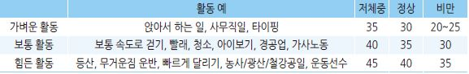
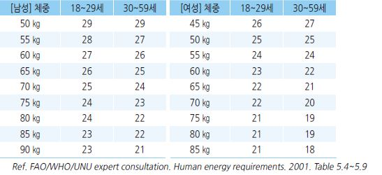
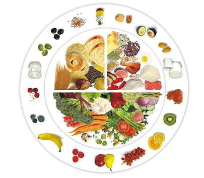
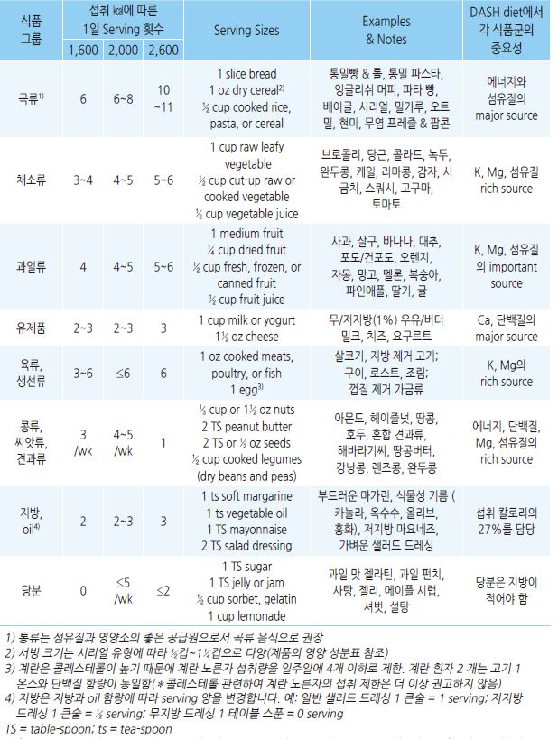
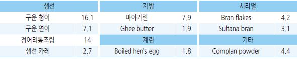

# 영양/식이 지침 Nutrition/Diet Guideline


## 건강 식품 피라미드

```

```

### 우리나라 영양소 섭취 비율(총 섭취 칼로리 대비)

* 권고 : 탄수화물 55~~65%, 단백질 7~~20%, 지방 15\~30% \[보건복지부. 한국인 영양소 섭취기준] (2015년)
* 성인 평균 섭취 비율 : 탄수화물 67%, 단백질 14%, 지방 17%

## 필요 칼로리 계산 방법

#### 간편 계산법

> ```
> (Ref. 비만관리를 위한 바른 식생활 가이드 [보건복지부])
> ```

*   1일 필요 열량 = 표준체중(㎏) × 활동량에 따른 열량( ㎉/㎏)

    •표준체중 = 신장(㎡) × 21(여)/22(남)

    •활동량에 따른 열량 (㎉/㎏)

    

#### BMR(Basal metabolic rate) 및 PAL(physical activity level)에 따른 1일 칼로리 요구량 계산법

*   필요 칼로리 = 체중(㎏) × BMR × PAL value

    •PAL value : 저 활동- 1.40~~1.69; 중등도 활동(1시간/일 달리기, 건설 노동자)- 1.70~~1.99

    •연령/성별/체중에 따른 BMR

    
*   1일 필요 열량 계산 예 : 운동을 하지 않는 70 ㎏ 사무직 40세 남성

    \= 체중 70 ㎏ × BMR 24 × PAL 1.5 = 2,520 ㎉

#### 활동 수준에 따른 칼로리 요구량 예시

```

```

## Serving size

#### 채소 \[약 75g]

* 익힌 녹황색 채소 ½컵 : broccoli, spinach, carrots, pumpkin
* 건조나 통조림 콩류 ½컵
* 익히지 않은 녹색 잎채소 또는 생 샐러드 야채 1컵 (250 ㎖)
* sweet corn ½컵
* 중간 크기 감자 ½개
* 중간 크기 토마토 1개

#### 과일 \[약 150g]

* 중간 크기 사과, 바나나, 오렌지, 배 1개
* 작은 살구, 키위, 자두 1개
* 파인애플/멜론 1조각, 망고 2조각
* 딸기 6개, 포도/체리 10개
* 과일 주스 125 ㎖ (½ cup) (무설탕)

#### 유제품

* 우유 250 ㎖, 액상 요구르트 200 ㎖
* 반고형 요구르트 125 g
* 체다 치즈 40 g, 리코타 치즈 120 g

## 지중해식 식단

- 충분한 식물성 식품(채소, 콩/견과류,

```
씨앗, 과일, 전곡류), 생선/해산물
```

* 올리브유(지방 공급원)
*   보통\~소량의 유제품(요구르트,

    치즈); 계란 ＜4개/주
* 낮은 빈도의 소량의 붉은 고기
* 보통\~소량의 와인
* 매우 적은 량의 설탕 또는 꿀 섭취

**섭취 음식 비중**

* 채소 ½
* 단백질 풍부 식품(고기, 생선, 치즈, 콩류) ¼
* 전분(시리얼, 곡류) ¼
* 과일 : 식간 섭취

> Ref. European Practical and Patient- Centred Guidelines. 2019

## DASH diet ([The Dietary Approaches to Stopping Hypertension](https://dashdiet.org/what-is-the-dash-diet.html))

* 식품 종류 : 과일, 채소, 무지방/저지방 우유 및 유제품, 전곡류, 생선, 가금류, 콩류, 씨앗류, 견과류
* 많은 성분 : K, Mg, Ca, 단백질, 섬유질
* 적은 성분 : Na, 당분, 설탕, 지방, 붉은 고기; 포화지방, 트랜스지방, 콜레스테롤
* 서빙 횟수(섭취량)는 권고되는 칼로리 양에 따라 다름
*   DASH diet에는 섬유질이 많아 팽만감과 설사를 유발할 수 있음

    •대처: 몇 주에 걸쳐 과일, 채소, 곡물 식품의 양을 점차 늘려감
* 유제품 소화에 어려움이 있는 경우 락타아제 효소 약제를 함께 복용하거나 유당이 없는 유제품을 선택
*   견과류를 선호하지 않는 경우에는 콩류나 씨앗류를 선택함

    

> ```
> Ref. NIH. Your Guide ToLowering Your Blood Pressure With DASH. 
> ```

## 식품 중의 칼슘 함유량

```
[㎎/식품 100 g or 우유 100 ㎖] (Ref. National osteoporosis society.)


```

## 식품 중의 Vit D 함유량 (㎍/100 g)



## 항염증 식단 지침

> ```
> (Ref. Rakel Family medicine 9th ed. 2016. Table 12-7.)
> ```

*   항염증 식단은 다음 질환의 치료에 도움이 됨 : 심장 질환, 류마티스 질환, 자가면역 질환, 만성 통증; 효과가 나타날 때까지

    \~6개월 소요될 수 있음
*   Omega-3 지방산 보충 : 이상적인 ω-6:ω-3 = 4:1 이지만, 현재의 일반적인 식단은 20:1 이상으로 ω-3가 절대적으로

    부족하므로 ω-3 보충이 필요

1. 붉은 고기, 가금류, 유제품 섭취를 줄임
2. 한류 어류, 아마씨, 호두, 녹색 잎채소 같은 ω-3 함유 음식 섭취를 늘림

•한류 어류를 주 2회 섭취 또는 어유 보충제를 0.5\~2 g bid 복용

•어유 대체 : 신선한 아마씨유 또는 아마씨유 보충제를 0.5\~2 g bid 복용

3. 다음의 ω-6 지방산 함유 음식 섭취를 줄임

① 마아가린,

② 옥수수, 목화씨, 포도씨, 땅콩, 잇꽃, 참깨, 콩, 해바라기 기름(partially hydrogenated oils),

③ 유통 기간이 긴 식품 회피(예: 크래커, 칩),

④ 고단백-저탄수화물 식사를 피함

4. 올리브 또는 카놀라 oil 같은 단불포화 기름으로 조리
5. 저탄고지(low-carbohydrate, high-protein) 식품은 ω-6 함량이 높은 경향이 있으므로 주의

## 한국인을 위한 식생활 지침

```
[보건복지부]
```

### 성인을 위한 식생활 지침

1. 채소, 과일, 우유 제품을 매일 먹는다.

•여러 가지 채소를 매일 먹는다.

•다양한 제철 과일을 먹는다.

•우유, 요구르트, 치즈 등 우유 제품을 간식으로 먹는다.

2. 지방이 많은 고기와 튀긴 음식을 적게 먹는다.

•고기는 기름을 떼어 내고 먹는다.

•튀기거나 볶은 음식을 적게 먹는다.

•등 푸른 생선을 자주 먹는다.

3. 짠 음식을 피하고 싱겁게 먹는다.

•장아찌, 젓갈과 같은 짠 음식을 적게 먹는다.

•음식을 만들거나 먹을 때 소금/간장을 적게 사용한다.

•국과 찌개의 국물을 적게 먹는다.

4. 활동량을 늘리고 알맞게 섭취한다.

•1회 ≥30분, 1주 ≥3\~4회 운동한다.

•생활 속에서의 신체 활동을 늘린다.

•단 음식과 단 음료 섭취를 제한한다.

•건강 체중을 유지한다.

5. 술을 마실 때는 그 양을 대폭 제한한다.

•되도록 음주하지 않는다.

•남자는 하루 2잔, 여자는 1잔 이내로 제한한다.

•임신부나 청소년은 절대 술을 마시지 않는다.

6. 세끼 식사를 규칙적으로 즐겁게 한다.

•아침을 거르지 않는다.

•저녁 식사는 가족과 함께 즐겁게 한다.

7. 음식은 먹을 만큼 준비하고 위생적으로 관리한다.

•음식은 먹을 만큼 만들거나 주문한다.

•남은 음식은 바로 냉장 보관하며, 오래 두지 않는다.

8. 밥을 주식으로 하는 우리 식생활을 즐긴다.

•다양한 반찬을 갖춘 식사로 영양의 균형을 유지한다.

### 고령자를 위한 식생활 실천 지침

1. 채소, 고기나 생선, 콩 제품 반찬을 골고루 먹는다.

•다양한 채소 반찬을 매끼 먹는다.

•고기나 생선, 계란, 콩 제품 반찬을 매일 먹는다.

2. 우유 제품과 과일을 매일 먹는다.

•우유, 요구르트나 두유를 매일 먹는다.

•다양한 제철 과일을 먹는다.

3. 짠 음식을 피하고 싱겁게 먹는다.

•장아찌, 젓갈 같은 짠 음식을 적게 먹는다.

•음식을 만들거나 먹을 때 소금/간장을 적게 사용한다.

•국과 찌개의 국물을 적게 먹는다.

4. 많이 움직여서 식욕과 적당한 체중을 유지한다.

•자신에게 알맞은 운동을 규칙적으로 한다.

•많이 걷고 움직이는 생활을 한다.

5. 술은 절제하고 물을 충분히 마신다.

•되도록 음주하지 않는다.

•술을 마실 때는 하루 1잔 이내로 제한한다.

•물을 자주 마신다.

6. 세끼 식사와 간식을 꼭 먹는다.

•세끼 식사를 규칙적으로 한다.

•조금씩 자주 먹는다.

7. 음식은 먹을 만큼 준비하고 오래 된 것은 먹지 않는다.

•음식은 한꺼번에 많이 만들지 않는다.

•남은 음식은 바로 냉장 보관하고 오래 두지 않는다.

## 심혈관 건강을 위한 식이 지침

```
Ref. AHA. 2021 Dietary Guidance to Improve Cardiovascular Health. Circulation. 2021;144
```

1.  건강한 체중을 만들고 유지하기 위해 에너지 섭취와 소모를 조정한다. 개인의 나이와 성별, 건강 상태, 활동 수준 등에

    맞게 조절된 신체 활동을 한다(최소 주당 150분).
2.  다양한 종류의 과일과 채소를 선택하여 충분히 먹는다. 주스보다 섬유질과 포만감을 더 쉽게 제공하는 통과일과 채소가

    좋다.
3. 정제된 곡물보다는 통곡으로 만든 제품과 식품을 선택한다.
4.  건강한 단백질 공급원을 선택한다: 대부분을 식물성 단백질(콩류, 견과류)로 선택하고, 어류 및 해산물, 저지방 또는

    무지방 유제품를 선택한다. 육류가 필요한 경우 얇게 기름기가 적고 가공되지 않은 불포화 지방 제품을 선택한다.
5. 열대 오일(코코넛, 팜, 팜 커널), 동물성 지방(버터, 라드), 부분 경화 지방보다 액체 식물 기름을 사용한다.
6.  초가공식품 대신 최소가공식품을 선택한다. 초가공식품은 인공색소와 향료, 방부제가 들어 있는 식품을 일컫지만

    이에 대한 일반적 정의는 없으며 일부 건강 식품은 초가공 식품 범주에 속할 수 있다.
7. 설탕 등 당분이 첨가된 음료와 음식의 섭취를 최소화한다.
8.  소금을 거의 넣지 않거나 전혀 넣지 않은 음식을 선택한다. 나트륨 섭취의 주요 원천은 가공식품, 포장식품, 외식 음식

    등이다. 칼륨을 대안으로 선택할 수 있다.
9. 만약 술을 마시지 않는다면 시작하지 않는다. 마시는 경우에도 하루 한 잔 이하로 제한한다.
10. 모든 상황에서 이 지침을 준수한다.

##

## ￭ 식이 섬유

> ```
> (Ref. 이유나 외. 식품의 영양성분 DB 구축사업(식이섬유분석). 한국보건산업진흥원 2005)
> ```

## 종류

### 식물성 식이 섬유

#### 수용성(soluble) 식이 섬유

* 물을 흡수하여 죽 같은 상태가 되는 탄수화물; 대부분의 식이 섬유가 해당
* 평균 열량 : 2\~3 ㎉/g

\*\* 작용 및 적응\*\*

* 심장 보호 : 소화기에서 cholesterol 입자에 부착되어 체내 흡수를 방해(특히 귀리)
* 당뇨병 완화 : 잘 흡수되지 않으므로 혈당 상승을 덜 일으킴
* 체중 감소 : 포만감을 유지하여 식사량을 줄임
* 변비 및 설사 개선 : 장 내에서 수분을 흡수하여 대변 덩이 형성

\*\* 주요 함유 식품\*\*

*   보리, 귀리, 미역(말린 것), 마늘, 섬유 음료, 다시마(말린 것), 대두, 빵(밀가루), 파래, 고구마, 늙은 호박, 깻잎, 시금치,

    취나물, 고추, 콩나물, 감, 백미, 된장, 배, 토마토, 고추장, 양파
* pectin : 과실류(사과, 배, 포도, 자두) 껍질, 감귤류(사탕무, 레몬, 오렌지) 껍질, 일부 채소류
* gum : 구아, 로커스트 콩
* 해조다당류 : 갈조류와 홍조류
* indigestible dextrin : 감자나 옥수수의 전분을 가열(배소)하여 만든 수용성 식이 섬유
* polydextrose : 화학적으로 합성한 식이 섬유

#### 불용성(insoluble) 식이 섬유

* 물에 녹지 않고 소화되지 않는 탄수화물(셀룰로오스, 헤미셀룰로오스) 및 리그닌
* 거의 100% 배출됨. 아연 등 무기물의 장 흡수를 억제함

\*\* 작용 및 적응\*\*

* 변비 : 대변 부피 및 수분 함량 증가, 대장 통과 시간 단축
* 체중 감소 : 포만감을 유지하여 식사량을 줄임

\*\* 주요 함유 식품\*\*

*   고추, 미역(말린 것), 김, 다시마(말린 것), 대두, 깻잎, 떡, 취나물, 고사리, 빵, 토란 대, 보리, 고추장, 된장, 현미, 파래,

    배추/양배추, 당근, 고구마, 늙은호박, 파, 시금치, 숙주
* cellulose : 밀, 보리, 현미 등 모든 식물의 세포벽
* hemicellulose : 곡류, 채소류
* lignin : 나무줄기나 고사리, 브로콜리 등의 단단한 줄기

### 동물성 식이 섬유

* 주성분 : 키틴질(키틴과 키토산의 총칭)
* 키틴 : 게, 새우, 오징어 등의 연체동물의 골격 성분
* 키토산 : 키틴의 N-deacel 화합물

### 기타 난소화성(indigestible) 물질

#### 당 알코올류

* 단당류 유도체
* 작용 : 장 흡수 속도 저하, 치아 건강에 유익
* 함유 식품 : 과일, 채소, 자일리톨, 만니톨

#### 올리고당류

* 단당류가 3\~10개 정도 결합된 당류
* 대장 속 박테리아에 의해 분해(소화 효소에 의해 분해되지 않음)
* 작용 : 장 건강에 유익
* 함유 식품 : 콩, 음료

#### 저항 전분

* 전분을 도정하거나 가공하는 등의 과정에서 생성되는 소화될 수 없는 성분
* 식이 섬유처럼 작용하여 소화되지 않고 대장 박테리아에 의해 발효

## 주요 식품

### 식이 섬유 함량이 높은 상용 식품

```
(상위 25종: 가식부 100 g 기준)


```

### 식품 내 총 식이 섬유에 대한 불용성 식이 섬유의 비율

```
(불용성 식이 섬유/총 식이 섬유, %)


```

### 식품중 식이 섬유 함량

```
(가식부 100 g 당 총 식이 섬유, 불용성 식이 섬유, 수용성 식이 섬유 g)


```
