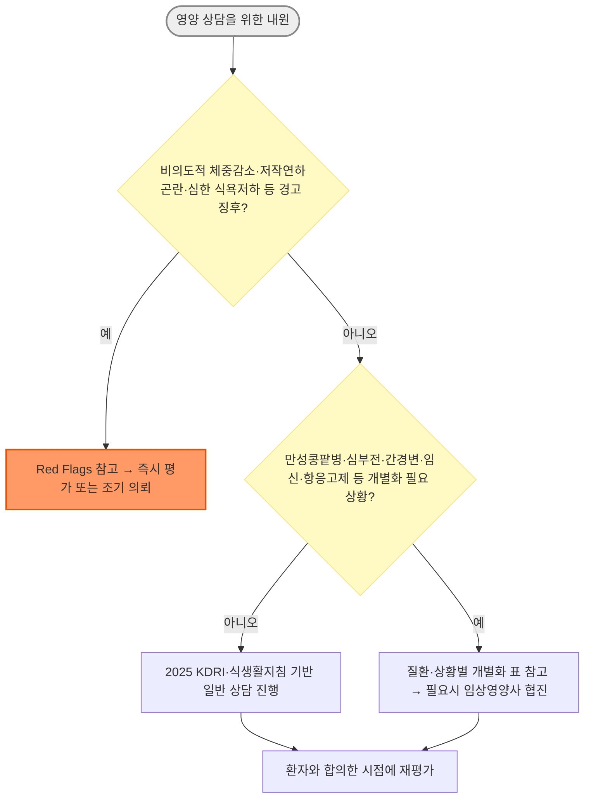

# 영양/식이 지침 Nutrition/Diet Guideline

> 이 챕터의 수치는 건강한 일반인을 위한 기준 또는 초기 추정치이다. 연령, 체격, 활동량, 임신·수유, 노쇠, 질환, 약물 및 치료 목표에 따라 개별화한다.

***

### <mark style="color:$danger;">🚩 Red Flags!</mark>

<mark style="color:$danger;">**즉각 조치 또는 응급 평가**</mark>

* 심한 저체중·장기간 영양 결핍 상태에서 급격히 영양 공급을 시작하는 경우 — 재영양증후군(refeeding syndrome) 위험(전해질·수분 관리 하 서서히 증량)
* 급성 탈수 또는 심한 전해질 이상을 동반한 지속적 구토·설사
* 음식 섭취 후 아나필락시스가 의심되는 증상
* 장폐색·심한 협착이 의심되는 상태에서의 식이섬유·팽창성 완하제 임의 증량

<mark style="color:$warning;">**당일 또는 조기 의뢰**</mark>

* 의도치 않은 체중감소(예: 최근 6개월 내 5% 이상) 또는 뚜렷한 근감소
* 새로 발생한 연하곤란 — 연하 평가 의뢰
* 임신 중 섭취 부족, 임신성 당뇨 조절 불량
* 만성콩팥병·심부전·간경변에서 나트륨·칼륨·수분 조절이 어려운 경우 — 임상영양사 협진 고려

<mark style="color:$info;">**외래 추적 / 추가 평가 계획**</mark> <mark style="color:$info;">- 즉각 위험 낮으나 호전 없으면 의뢰</mark>

* 식이섬유·나트륨·첨가당 목표에 도달하지 못하는 경우 — 반복 상담 및 재평가
* 오메가-3·비타민 D·칼슘 등 보충제 사용을 원하는 경우 — 적응증 확인 후 개별화
* 환자와 합의한 시점에 재평가하여 목표 달성 여부와 실천 장애요인을 확인한다. 체중·혈압은 수주 내, HbA1c는 통상 약 3개월, 지질은 생활습관·약물치료와 임상 상황에 맞추어 평가 시점을 정한다.

***

## <mark style="color:green;">2025 한국인 영양소 섭취기준</mark>

2025 한국인 영양소 섭취기준(KDRIs)은 건강한 개인과 인구집단의 영양 상태를 평가하고 식사를 계획하기 위한 기준이다. 평균필요량, 권장섭취량, 충분섭취량, 상한섭취량, 에너지적정비율 및 만성질환위험감소섭취량은 의미가 서로 다르므로 단일한 '최소 섭취량'으로 해석하지 않는다.

### <mark style="color:orange;">에너지적정비율과 당류</mark>

<table><thead><tr><th width="110">항목</th><th width="180">2025 KDRI</th><th>임상적 해석</th></tr></thead><tbody><tr><td>탄수화물</td><td>총 에너지의 50\~65%</td><td>정제곡물·첨가당보다 통곡물, 콩류, 채소 등 질이 좋은 탄수화물을 우선한다.</td></tr><tr><td>단백질</td><td>총 에너지의 10\~20%</td><td>필요량은 체중, 연령, 근감소증, 임신·수유 및 신장·간질환에 따라 달라진다.</td></tr><tr><td>지방</td><td>총 에너지의 15\~30%</td><td>포화지방 대신 불포화지방이 풍부한 식품을 선택한다.</td></tr><tr><td>포화지방산</td><td>총 에너지의 7% 미만</td><td>지방이 많은 육류, 버터, 팜유·코코넛유 등 주요 급원의 섭취량을 평가한다.</td></tr><tr><td>트랜스지방산</td><td>총 에너지의 1% 미만</td><td>부분경화유와 이를 사용한 가공식품을 줄인다.</td></tr><tr><td>총당류</td><td>총 에너지의 20% 이내</td><td>식품에 자연적으로 존재하는 당과 첨가당을 모두 포함한다.</td></tr><tr><td>첨가당</td><td>총 에너지의 10% 이내로 제한</td><td>설탕, 물엿, 시럽, 꿀 등 조리·가공 과정에서 첨가한 당을 포함한다.</td></tr><tr><td>가당음료</td><td>가능한 줄임</td><td>탄산음료, 가당 커피·차, 스포츠·에너지음료 등을 포함한다.</td></tr></tbody></table>

Ref. 보건복지부·한국영양학회. 2025 한국인 영양소 섭취기준. 2025.

***

## <mark style="color:green;">식품구성자전거</mark>

식품구성자전거는 다섯 가지 식품군을 필요한 만큼 균형 있게 섭취하고, 물과 신체활동을 함께 실천하도록 나타낸 교육 모형이다. 식품군별 섭취 횟수는 연령·성별·필요 에너지에 따라 달라지므로 그림의 횟수를 모든 환자에게 동일하게 적용하지 않는다.

* 곡류 : 가능하면 통곡·잡곡을 포함한다.
* 고기·생선·달걀·콩류 : 콩류, 생선, 살코기 등 다양한 단백질 급원을 선택한다.
* 채소류 : 매끼 다양한 색의 채소를 충분히 섭취한다.
* 과일류 : 주스보다 통과일을 우선한다.
* 우유·유제품류 : 무가당 제품을 우선하며, 섭취하지 않는 경우 칼슘·단백질을 제공하는 대체 식품을 계획한다.
* 물과 신체활동 : 갈증, 기후, 활동량과 질환별 수분 제한 여부를 고려한다.


이미지 사용 시 2015년판 '건강 식품 피라미드'가 아니라 [2020 KDRI 활용자료에서 개정한 공식 식품구성자전거](https://www.kns.or.kr/FileRoom/FileRoom_view.asp?BoardID=Kdr&idx=123)를 사용한다. 이 이미지는 2021 한국인을 위한 식생활지침을 반영하였다.


Ref. 보건복지부·한국영양학회. 2020 한국인 영양소 섭취기준 활용자료. 2021.

***

## <mark style="color:green;">한국인을 위한 식생활지침</mark>

2021년 보건복지부·농림축산식품부·식품의약품안전처 공동 지침이다.

1. 매일 신선한 채소, 과일과 함께 곡류, 고기·생선·달걀·콩류, 우유·유제품을 균형 있게 먹자.
2. 덜 짜게, 덜 달게, 덜 기름지게 먹자.
3. 물을 충분히 마시자.
4. 과식을 피하고 활동량을 늘려서 건강체중을 유지하자.
5. 아침식사를 꼭 하자.
6. 음식은 위생적으로, 필요한 만큼만 마련하자.
7. 음식을 먹을 때는 각자 덜어 먹기를 실천하자.
8. 술은 절제하자.
9. 우리 지역 식재료와 환경을 생각하는 식생활을 즐기자.


술을 마시지 않는 사람에게 건강을 목적으로 음주를 시작하도록 권하지 않는다. 음주 위험은 양이 적어도 0이 아니며, 임신·수유, 청소년, 운전·기계 조작 전, 간질환, 음주와 상호작용하는 약물 복용 및 음주조절장애가 있는 경우에는 금주한다.


Ref. 보건복지부·농림축산식품부·식품의약품안전처. 한국인을 위한 식생활지침. 2021.

***

## <mark style="color:green;">필요 에너지의 초기 추정</mark>

### <mark style="color:orange;">간편 추정법</mark>

* 1일 필요 에너지 = 임상적으로 정한 목표체중 또는 평가용 체중(㎏) × 활동 수준별 에너지 계수(㎉/㎏/day)
* 목표체중은 현재 체중, BMI, 체성분, 최근 체중 변화, 부종·복수 및 치료 목표를 고려하여 정한다. 특정 BMI를 모든 환자에게 일률적으로 적용하지 않는다.


**아래 계수는 대한당뇨병학회에서 안내하는 활동량 기반 임상 간편 추정 범위이며 KDRI의 공식 에너지 필요추정식은 아니다.**\
초기 추정치는 2\~4주간의 체중 변화, 섭취량, 허리둘레, 신체활동 및 치료 반응에 따라 조정한다. 체중 감량이 필요하면 유지 필요량에서 통상 300\~500 ㎉/day 감량하는 방법을 참고하되 과도한 제한을 피한다. 임신·수유, 성장기, 심한 저체중·비만, 노쇠, 부종·복수, 절단, 화상, 중환자 및 섭식장애에는 그대로 적용하지 않는다. 가능하면 검증된 연령·성별 에너지 필요추정량 또는 간접열량측정을 사용한다.


<table><thead><tr><th width="220">활동 수준</th><th width="150">초기 계수</th><th>적용 시 주의</th></tr></thead><tbody><tr><td>육체활동이 거의 없음</td><td>25\~30 ㎉/㎏/day</td><td>사무직이라도 비운동성 활동량과 치료 목표에 따라 필요량 차이가 크다.</td></tr><tr><td>보통의 활동</td><td>30\~35 ㎉/㎏/day</td><td>실제 섭취량과 체중 변화를 함께 평가한다.</td></tr><tr><td>심한 육체활동</td><td>35\~40 ㎉/㎏/day</td><td>직업·운동 종류와 훈련량을 확인하고 필요시 임상영양 평가를 시행한다.</td></tr></tbody></table>

Ref. 대한당뇨병학회. 나의 1일 에너지 필요량은?; 질병관리청 국가건강정보포털. 건강한 체중조절을 위한 식사.

***

## <mark style="color:green;">실용적인 식사 구성</mark>

고정된 '1회 분량'은 식품 분류체계와 개인의 필요 에너지에 따라 달라진다. 다음 원칙을 우선하고, 영양소 기준은 2025 KDRI를 적용하되 구체적인 식사구성안은 2020 KDRI 활용자료 또는 질환별 식품교환표를 참고한다.

* 접시의 약 절반 : 전분이 적은 채소
* 약 ¼ : 통곡·잡곡 등 곡류 또는 전분 식품
* 약 ¼ : 콩류, 생선, 달걀, 가금류, 살코기 등 단백질 식품
* 과일 : 주스보다 통과일
* 유제품·대체품 : 무가당 제품을 우선하고 칼슘 강화 여부를 확인

> 과일주스는 무가당이라도 통과일보다 식이섬유와 포만감이 적고 빠르게 섭취되므로 일상적인 과일 대체품으로 권하지 않는다. 말린 과일은 수분이 적어 당과 에너지 밀도가 높으므로 소량 섭취한다.

***

## <mark style="color:green;">건강한 식사 패턴</mark>

### <mark style="color:orange;">지중해식 식사</mark>

지중해식 식사는 특정 식품 하나가 아니라 다음 특징을 공유하는 전체 식사 패턴이다.

* 채소, 과일, 통곡물, 콩류, 견과류와 씨앗류를 충분히 섭취
* 주요 지방으로 올리브유 등 불포화지방 사용
* 생선·해산물을 규칙적으로 섭취
* 유제품은 주로 요구르트·치즈 등으로 적당량 섭취
* 붉은 고기와 가공육, 정제곡물, 첨가당과 초가공식품은 제한

달걀을 일률적으로 주 4개 이하로 제한하지 않는다. 전체 식사 패턴, LDL 콜레스테롤, 당뇨병 및 동반질환을 함께 고려한다. 와인은 건강상 필수 구성요소가 아니며, 비음주자에게 시작하도록 권하지 않는다.

### <mark style="color:orange;">DASH 식사</mark>

DASH(Dietary Approaches to Stop Hypertension)는 채소, 과일, 통곡물, 무지방·저지방 유제품, 생선, 가금류, 콩류, 견과류와 식물성 기름을 중심으로 하고 포화지방, 가공육, 가당음료와 단 음식을 제한하는 식사 패턴이다.

* 표준 나트륨 목표 : 2,300 ㎎/day
* 1,500 ㎎/day의 저나트륨 식사는 혈압을 더 낮출 수 있으나 식사 지속 가능성, 영양 상태 및 임상 상황을 고려하여 개별화한다.
* 식이섬유 섭취가 적던 환자는 복부팽만과 가스를 줄이기 위해 채소·콩류·통곡물 섭취를 수주에 걸쳐 늘린다.

#### <mark style="color:$primary;">2,000 ㎉/day DASH 식사의 예</mark>

<table><thead><tr><th width="150">식품군</th><th width="130">권장 섭취</th><th>1회 분량 예</th></tr></thead><tbody><tr><td>곡류</td><td>6\~8회/day</td><td>빵 1쪽, 조리한 밥·국수·시리얼 ½컵</td></tr><tr><td>채소</td><td>4\~5회/day</td><td>생잎채소 1컵 또는 자른·익힌 채소 ½컵</td></tr><tr><td>과일</td><td>4\~5회/day</td><td>중간 크기 과일 1개 또는 자른 과일 ½컵</td></tr><tr><td>무지방·저지방 유제품</td><td>2\~3회/day</td><td>우유·요구르트 1컵 또는 치즈 약 40 g</td></tr><tr><td>살코기·가금류·생선</td><td>6회 이하/day</td><td>조리한 식품 1 oz(약 28 g)를 1회로 계산</td></tr><tr><td>견과류·씨앗·마른콩</td><td>4\~5회/week</td><td>견과류 ⅓컵, 견과버터 2큰술 또는 익힌 콩 ½컵</td></tr><tr><td>지방·기름</td><td>2\~3회/day</td><td>식물성 기름 1작은술 등</td></tr><tr><td>단 음식</td><td>5회 이하/week</td><td>설탕·잼 1큰술 등; 적을수록 좋음</td></tr></tbody></table>


**⚠️ 염화칼륨 함유 소금 대체제 주의**\
염화칼륨 함유 소금 대체제는 일부 성인의 혈압 관리에 도움이 될 수 있지만, 만성콩팥병, 고칼륨혈증 또는 ACE 억제제·ARB·ARNI·MRA 등 혈중 칼륨을 높일 수 있는 약물 복용 환자에게 임의로 권하지 않는다.


Ref. National Heart, Lung, and Blood Institute. DASH Eating Plan. Updated 2026.

***

## <mark style="color:green;">심혈관 건강을 위한 식이 지침</mark>

2026 American Heart Association 과학적 성명의 핵심은 다음과 같다.

1. 건강체중을 달성하고 유지하도록 에너지 섭취와 소비를 조절한다.
2. 다양한 채소와 과일을 충분히 섭취한다.
3. 정제곡물보다 통곡물 식품을 선택한다.
4. 콩류·견과류·씨앗류 등 식물성 단백질, 생선·해산물, 무지방·저지방 유제품을 우선한다. 붉은 고기를 먹는 경우 지방이 적은 부위를 소량 선택하고 가공육은 피하거나 최소화한다.
5. 포화지방이 많은 식품 대신 견과류, 씨앗류, 아보카도와 비열대성 식물성 기름 등 불포화지방 급원을 선택한다.
6. 초가공식품보다 최소가공식품을 선택한다.
7. 음료와 음식에 첨가된 당류를 최소화한다.
8. 나트륨이 적은 식품을 선택하고 소금은 적게 사용한다.
9. 술을 마시지 않는다면 시작하지 않고, 마신다면 섭취량을 제한한다.

'초가공식품'은 단순히 색소·향료·방부제가 들어 있는 식품만을 뜻하지 않는다. 산업적 제형, 여러 가공 단계와 첨가 원료 등을 고려하는 분류이며, 모든 가공식품의 영양가가 동일한 것은 아니므로 영양표시와 전체 식사 패턴을 함께 평가한다.

Ref. Lichtenstein AH, et al. 2026 Dietary Guidance to Improve Cardiovascular Health: A Scientific Statement From the American Heart Association. Circulation. 2026;153:e1285-e1295.

***

## <mark style="color:green;">주요 영양소</mark>

### <mark style="color:orange;">식이섬유</mark>

식이섬유는 사람의 소장에서 소화·흡수되지 않는 탄수화물과 리그닌 중 식품에 본래 존재하거나, 분리·합성되어 유익한 생리작용이 확인된 성분을 포함한다. 수용성·불용성만으로 생리효과를 단정하지 않고 점성, 발효성, 식품 구조와 섭취량을 함께 고려한다.

#### <mark style="color:$primary;">2025 KDRI 충분섭취량</mark>

* 성인 식이섬유 충분섭취량은 기본적으로 12.5 g/1,000 ㎉를 바탕으로 연령·성별 필요 에너지를 고려하여 산출한다.
* 성인 남성 19세 이상 : 30 g/day
* 성인 여성 19\~49세 : 20 g/day
* 성인 여성 50세 이상 : 25 g/day
* 임신부·수유부 : 해당 연령 여성 기준에 5 g/day 부가
* 충분섭취량은 최소 섭취량이나 반드시 넘겨야 하는 하한선이 아니다.

#### <mark style="color:$primary;">특성에 따른 분류와 주요 작용</mark>

<table><thead><tr><th width="150">특성</th><th width="190">대표 성분·식품</th><th>주요 고려사항</th></tr></thead><tbody><tr><td>점성이 있는 수용성 섬유</td><td>귀리·보리의 β-glucan, psyllium 등</td><td>일부에서 LDL 콜레스테롤과 식후 혈당을 낮추고 대변 형태를 개선한다.</td></tr><tr><td>발효성이 높은 섬유</td><td>inulin, fructooligosaccharide, 일부 콩류·채소</td><td>장내 미생물에 의해 발효되며, 갑자기 늘리면 가스·복부팽만을 유발할 수 있다.</td></tr><tr><td>불용성·발효성이 낮은 섬유</td><td>밀기울, cellulose가 풍부한 통곡물·채소</td><td>대변 부피를 늘리고 배변을 돕지만, 모든 변비에 동일한 효과가 있는 것은 아니다.</td></tr><tr><td>저항전분</td><td>콩류, 일부 전곡·덜 익은 바나나, 조리 후 식힌 전분 식품 등</td><td>소장에서 소화되지 않고 대장에서 일부 발효된다. 식품·조리법에 따라 함량이 달라진다.</td></tr></tbody></table>

#### <mark style="color:$primary;">실용적 섭취 원칙</mark>

* 잡곡밥, 콩류, 채소, 통과일, 견과류와 해조류 등 다양한 식품으로 섭취한다.
  * 한 끼 음식만으로 목표량을 충족하려 하지 말고, 통곡물·콩류·채소·통과일·견과류를 하루 전체 식사에 나누어 포함한다.
* 100 g당 함량 순위보다 실제 1회 섭취량과 총 식사량을 평가한다.
* 섭취량은 수주에 걸쳐 서서히 늘리고, 수분 제한이 없는 경우 물을 충분히 섭취한다.
* 장폐색·분변매복이 의심되거나 심한 협착이 있는 환자에게 식이섬유 또는 팽창성 완하제를 임의로 늘리지 않는다.
* 식이섬유 보충제는 약물 흡수에 영향을 줄 수 있으므로 제품 설명과 약물별 상호작용을 확인하여 복용 간격을 정한다.

#### <mark style="color:$primary;">국내 식품성분 자료의 사용</mark>

식품별 식이섬유 함량은 품종, 수분, 조리 상태와 분석법에 따라 달라진다. 2005년 식품의 영양성분 DB 구축사업의 100 g당 순위표는 현재의 임상 식사상담 자료로 사용하지 않고 다음 최신 자료에서 식품명·조리 상태·기준량을 확인한다.

* 농촌진흥청 국립식량과학원. 국가표준식품성분 DB 10.4. 2026.
* 식품의약품안전처. 식품영양성분 데이터베이스(K-FIND).

Ref. U.S. Food and Drug Administration. Questions and Answers on Dietary Fiber. Updated 2024.

### <mark style="color:orange;">칼슘</mark>

칼슘 함량은 식품의 종류뿐 아니라 가공·강화 여부와 두부 응고제 등에 따라 크게 달라진다. 외국 제품의 100 g당 수치보다 국내 제품의 통상 1회 섭취량과 영양표시를 사용한다.

<table><thead><tr><th width="150">주요 급원</th><th width="190">통상 섭취 단위 예</th><th>확인할 점</th></tr></thead><tbody><tr><td>우유·요구르트</td><td>우유 1컵, 무가당 요구르트 1용기</td><td>제품별 용량과 칼슘 강화 여부를 확인한다.</td></tr><tr><td>치즈</td><td>1\~2장 또는 소량</td><td>칼슘은 풍부하지만 나트륨·포화지방도 고려한다.</td></tr><tr><td>두부</td><td>약 ⅓모</td><td>칼슘염 응고제 사용 여부에 따라 함량 차이가 크므로 제품 표시를 확인한다.</td></tr><tr><td>뼈째 먹는 생선</td><td>멸치 한 줌보다 적은 반찬 분량, 뼈째 든 통조림 생선 1회분</td><td>말린 생선은 나트륨 섭취를 함께 고려한다.</td></tr><tr><td>칼슘 강화 식물성 음료</td><td>1컵</td><td>무가당 제품을 선택하고 칼슘·비타민 D 및 단백질 함량을 확인한다.</td></tr><tr><td>짙은 녹색 채소·참깨류</td><td>반찬 1회분</td><td>식품별 흡수율과 실제 섭취량 차이가 크므로 단독 급원에 의존하지 않는다.</td></tr></tbody></table>

### <mark style="color:orange;">비타민 D</mark>

비타민 D의 식품 함량은 자연 함유량과 강화 여부에 따라 달라진다. `1 μg = 40 IU`이다.

<table><thead><tr><th width="170">주요 급원</th><th width="150">통상 섭취 단위 예</th><th>확인할 점</th></tr></thead><tbody><tr><td>등푸른 생선·지방이 많은 생선</td><td>구이 또는 조림 1토막</td><td>어종·양식 여부·조리법에 따라 함량 차이가 크다.</td></tr><tr><td>달걀</td><td>1\~2개</td><td>주로 노른자에 들어 있으나 단독으로 충분량을 충족하기 어렵다.</td></tr><tr><td>비타민 D 강화 우유·식물성 음료·시리얼</td><td>제품 표시상의 1회 제공량</td><td>모든 제품이 강화된 것은 아니므로 영양표시를 확인한다.</td></tr><tr><td>버섯류</td><td>반찬 1회분</td><td>자외선 조사 여부에 따라 비타민 D2 함량 차이가 크다.</td></tr></tbody></table>

식사만으로 충분한 섭취가 어려울 수 있으나, 모든 사람에게 혈중 25(OH)D 검사나 보충제를 일률적으로 권하지 않는다. 결핍 위험, 골다공증, 흡수장애, 약물, 임신·수유 및 신장·간질환을 고려하여 검사와 보충 여부를 결정한다.

### <mark style="color:orange;">오메가-3 지방산</mark>

* 일반 인구의 심혈관질환 일차예방을 위한 오메가-3 보충제의 일률적 사용은 권고하지 않는다.
* 생선 등 식품 섭취를 우선한다.
* EPA·DHA 제제는 고중성지방혈증 등 적응증과 제품의 실제 EPA·DHA 함량을 확인하여 사용한다.
* 고용량 사용 시 심방세동과 출혈 위험, 항혈전제 병용 여부를 고려한다.
* 아마씨·호두 등의 α-linolenic acid(ALA)는 유익한 식품 성분이지만 어유의 EPA·DHA를 동일 용량으로 대체하는 것으로 간주하지 않는다.
* 옥수수유·콩기름·해바라기유 등 종자유를 ω-6 지방산이라는 이유만으로 일률적으로 제한하지 않는다. 포화지방을 불포화지방으로 대체하는 전체 식사 패턴이 중요하다.

Ref. National Institutes of Health, Office of Dietary Supplements. Omega-3 Fatty Acids: Fact Sheet for Health Professionals.

***

## <mark style="color:green;">질환·상황별 개별화</mark>

<table><thead><tr><th width="150">상황</th><th>주요 고려사항</th></tr></thead><tbody><tr><td>고령자·노쇠</td><td>비의도적 체중 감소, 식욕저하, 근감소증, 저작·연하곤란, 우울, 인지기능과 식품 접근성을 평가한다. 단백질 식품을 끼니마다 배치하고 가능한 경우 근력운동을 병행한다. 단백질은 대체로 최소 1.0 g/㎏/day, 건강한 고령자는 1.0\~1.2 g/㎏/day를 참고하고, 1.2\~1.5 g/㎏/day는 급·만성질환, 영양불량 또는 회복기에서 신기능·질환·내약성을 고려하여 개별적으로 적용한다.</td></tr><tr><td>당뇨병</td><td>탄수화물의 총량과 식사별 분배, 첨가당, 식이섬유 및 저혈당 위험을 함께 고려한다. 특정 탄수화물 비율을 모든 환자에게 일률적으로 적용하지 않는다.</td></tr><tr><td>만성콩팥병</td><td>단백질, 나트륨, 칼륨, 인과 수분은 병기, 투석 여부, 검사 결과와 영양 상태에 따라 개별화한다. 건강식품·소금 대체제의 칼륨도 확인한다. 채소는 껍질을 벗기거나 잘게 썰어 물에 담근 뒤 데쳐서 사용하고 데친 물은 버리면 칼륨 섭취를 줄이는 데 도움이 된다.</td></tr><tr><td>심부전·간경변</td><td>나트륨과 수분 제한은 울혈·복수·저나트륨혈증, 약물 및 영양 상태를 고려한다. 지나친 제한으로 섭취량이 감소하지 않도록 한다.</td></tr><tr><td>항응고제 복용</td><td>Warfarin 복용 중에는 비타민 K 함유 채소를 금지하지 않고 섭취량을 일관되게 유지한다. DOAC에는 같은 비타민 K 제한을 적용하지 않는다.</td></tr><tr><td>장기 약물 복용</td><td>Metformin 장기 복용자에서는 빈혈·신경병증이 있거나 장기간 사용한 경우 비타민 B12 평가를 고려한다. PPI·H2RA는 장기 처방의 적응증을 재평가하고, 결핍 증상이나 위험요인이 있을 때 비타민 B12 평가를 고려한다. PPI 사용자는 저마그네슘혈증 증상, 장기간 사용 또는 관련 약물 병용 등 위험요인이 있을 때 마그네슘 평가를 고려한다.</td></tr><tr><td>임신·수유</td><td>에너지·단백질·철·엽산·요오드·콜린 등 필요량 변화와 식품 안전을 고려한다. 임신 중에는 금주한다.</td></tr><tr><td>저작·연하곤란</td><td>단순히 부드러운 음식으로 제한하지 말고 연하 평가에 따른 음식의 질감·점도 조절과 영양 밀도 보강을 시행한다.</td></tr></tbody></table>

Ref. Volkert D, et al. ESPEN practical guideline: Clinical nutrition and hydration in geriatrics. Clin Nutr. 2022;41:958-989; American Diabetes Association. Standards of Care in Diabetes—2026.

***

```mermaid
graph TD
    Start([영양 상담을 위한 내원]) --> Screen{"비의도적 체중감소·저작연하곤란·심한 식욕저하 등 경고 징후?"}
    Screen -->|예| Refer["Red Flags 참고 → 즉시 평가 또는 조기 의뢰"]
    Screen -->|아니오| Chronic{"만성콩팥병·심부전·간경변·임신·항응고제 등 개별화 필요 상황?"}
    Chronic -->|예| Individualize["질환·상황별 개별화 표 참고 → 필요시 임상영양사 협진"]
    Chronic -->|아니오| General["2025 KDRI·식생활지침 기반 일반 상담 진행"]
    General --> FollowUp["환자와 합의한 시점에 재평가"]
    Individualize --> FollowUp
    style Start fill:#eeeeee,stroke:#888888,stroke-width:2px
    style Screen fill:#fff9c4,stroke:#ffe082
    style Chronic fill:#fff9c4,stroke:#ffe082
    style Refer fill:#f96,stroke:#e65100,stroke-width:2px
```

<strong>영양 상담·의뢰 판단 흐름</strong>

***

### <mark style="color:red;">질병코드</mark>

Z71.3 식사 상담 및 감시

> 비만, 당뇨병, 이상지질혈증, 만성콩팥병 등 기저질환이 있는 경우에는 해당 질환 코드를 우선 또는 함께 적용하고, Z71.3은 식사 상담 및 감시를 위해 진료한 상황에 맞추어 사용한다.

***

### <mark style="color:$success;">핵심 영양상담 지도</mark>

> **간단한 상담 구조 (5A's)**
>
> 1. **Ask** : 현재 식습관, 알레르기·제한식, 보충제 사용 여부를 확인합니다.
> 2. **Advise** : 개인 상황에 맞춘 구체적 권고를 제공합니다(예: "잡곡을 늘리세요"보다 "밥의 1/3을 현미·잡곡으로 바꿔보세요"가 더 실천 가능합니다).
> 3. **Assess** : 변화 의지와 준비도를 확인합니다.
> 4. **Assist** : 구체적 실천 방법과 장애 요인 해결을 함께 계획합니다.
> 5. **Arrange** : 필요시 임상영양사·전문 클리닉 의뢰 및 재평가 일정을 잡습니다.

> **언제 다시 병원을 방문해야 하나요?**
>
> * 의료진과 정한 재평가 시점에도 목표에 도달하지 못했거나 식사 실천이 어려운 경우
> * 의도치 않은 체중 감소나 식욕 저하가 지속되는 경우
> * 보충제(오메가-3, 칼슘, 비타민 D 등) 복용을 고려 중이나 복용 중인 약물과의 상호작용이 확인되지 않은 경우

***

### <mark style="color:blue;">환자 안내서</mark>


**한 가지 '건강식품'보다 매일의 전체 식사 패턴이 중요합니다**

특정 슈퍼푸드나 보충제 하나에 의존하기보다, 매일 반복하는 식사 전체의 균형이 건강에 더 큰 영향을 줍니다.


#### <mark style="color:$primary;">일상생활에서 어떻게 관리하나요?</mark>

* 가능한 규칙적인 식사 패턴을 유지하되, 당뇨약·인슐린 사용, 교대근무와 생활 습관에 맞추어 식사 횟수와 시간을 조정하십시오.
* **매끼 채소와 단백질 식품을 포함하십시오.** 흰쌀·흰빵의 일부를 잡곡·통곡물·콩류로 바꾸어 보십시오.
* **과일은 주스보다 통째로 드십시오.** 가당음료(탄산음료, 가당 커피·차, 스포츠음료 등)는 가능한 줄이십시오.
* **국·찌개 국물과 젓갈·장아찌 같은 고나트륨 식품을 줄이고, 즉석라면·가공육 등 초가공식품의 섭취 빈도를 낮추십시오.**
* **식이섬유는 갑자기 많이 늘리지 마십시오.** 수주에 걸쳐 서서히 늘리고, 수분 제한이 없다면 물도 충분히 드십시오.
  * 2025 KDRI 충분섭취량은 성인 남성 30 g/day, 여성 19\~49세 20 g/day, 여성 50세 이상 25 g/day입니다. 이는 반드시 넘어야 하는 최소량은 아닙니다. 한 끼 음식만으로 채우려 하지 말고 통곡물·콩류·채소·통과일·견과류를 하루 전체 식사에 나누어 포함하십시오.
* 술을 마시지 않는다면 건강을 위해 새로 시작할 필요가 없습니다.

#### <mark style="color:$primary;">보충제는 꼭 필요한가요?</mark>

* 생선 섭취가 적다면 먼저 식사 구성을 조정하십시오. 오메가-3 보충제는 고중성지방혈증 등 명확한 적응증이나 의료진의 판단이 있을 때 고려합니다.
* 햇빛 노출 부족·흡수장애 등은 비타민 D 결핍 위험을, 유제품·칼슘 강화식품 섭취 부족은 칼슘 섭취 부족을 각각 평가하는 항목입니다. 임신 중이거나 임신을 계획하는 경우에는 엽산·철분 등 필요한 보충제를 의료진과 상의하십시오.
* **대체로 불필요한 경우** : 균형 잡힌 식사를 하고 있고 특별한 결핍 위험이 없다면 오메가-3·비타민 D·칼슘 등을 일률적으로 추가할 필요는 없습니다. 프로바이오틱스도 특정 질환에 대한 효과가 확립된 것은 아니므로 막연히 복용하기보다 필요한 이유를 먼저 확인하십시오.
* 칼슘·비타민 D는 제품마다 함량 차이가 크므로 영양표시를 확인하십시오.

#### <mark style="color:$primary;">이런 경우에는 미리 의료진과 상의하세요</mark>

* 만성콩팥병, 심부전, 간질환, 임신·수유 또는 항응고제 복용 중에는 일반적인 식이 원칙을 그대로 따르기 전에 의료진과 상의하십시오.
* Metformin을 장기간 복용하면서 빈혈·신경병증이 있거나, 위산 억제제를 오래 복용하면서 결핍 증상 또는 위험요인이 있다면 의료진과 검사 필요성을 상의하십시오.
* 의도치 않은 체중 감소나 식욕 저하가 계속되는 경우에도 미리 알려주십시오.
